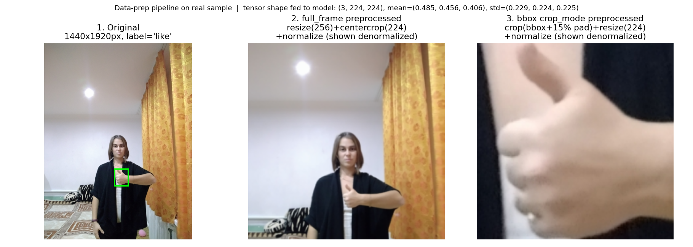
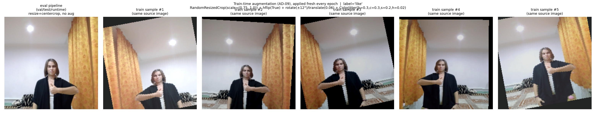

# Data Preparation

> **⚠ Scope pivot (2026-07-14, [AD-18](../architecture-and-decisions.md#ad-18--trim-training-classes-to-palm--fist)):**
> the working class list is trimming from 8 classes to **`palm` + `fist`** for
> the cursor-control design ([Strategy 3](../strategies/3-cursor-and-click/03-cursor-and-click.md)).
> The *pipeline* documented here is unchanged — only `configs/data.yaml →
> classes:` shrinks. The 8-class split counts and flip-safety notes below
> describe the pre-pivot configuration and stay valid for the existing
> checkpoints; this page's tables get regenerated when the binary retrain runs.

**What happens to a HaGRID image between disk and the model.** This documents
the full offline data-prep pipeline: indexing, the train/val/test split and its
percentages, cropping, normalization, and augmentation. It is the companion to
[data.md](data.md) (which covers *where the data came from* — sources, downloads,
duplicate guarantees) — this file covers *what we do with it before training*.

Everything here is config-driven from [`configs/data.yaml`](../configs/data.yaml)
and implemented in [`src/data/`](../src/data/). Runnable end-to-end:

```bash
python -m src.data.dataset          # prints the split summary table below
```

---

## How we're doing it all — step by step

Plain-language walkthrough of the whole journey, one raw file to one training
batch. Each step names the code that does it and links to the detailed section
below for the exact mechanics/numbers.

1. **Start with what's on disk.** Two things exist independently: per-class
   HaGRID annotation JSONs (`DATA/ann_*`, one record per image UUID with its
   label, bbox, landmarks, user_id) and downloaded JPEGs in two folders
   (`DATA/images/train_val/`, `DATA/images/subsample/`). Neither folder name
   means anything for training — they're just where the pixels happened to be
   downloaded (see [data.md](data.md)).

2. **Build one combined index.** `build_full_index()` walks every image file
   actually on disk, looks up its annotation record by UUID, and produces a
   single table: `uuid, label, label_idx, path, bbox, user_id, has_ann`. This
   is the moment "two folders + eighteen JSON files" becomes one flat list of
   8594 usable images. Validation runs here too — bad bboxes or missing labels
   get caught before anything is split. → [§2 The index](#2-the-index)

3. **Decide who goes where.** `make_splits()` divides that index into train,
   val, and test — **70/15/15, grouped by `user_id`** so the same person's
   hands never appear in two splits. This is a pure decision about *which rows
   belong to which split*; no pixels are touched or moved on disk. The result
   is asserted leak-free (0 shared users, 0 shared UUIDs) before training ever
   sees it. → [§3 Split & percentages](#3-split--percentages-ad-16)

4. **Decide what part of each image the model looks at.** `HagridDataset`
   opens the image and, per `crop_mode`, either keeps the whole frame
   (`full_frame`) or crops tightly to the annotated hand (`bbox`, +15%
   padding). This happens once per image, right after loading, before any
   resizing. → [§4 Cropping](#4-cropping-ad-04)

5. **Turn pixels into the numbers the network expects.** `build_transforms()`
   applies a torchvision pipeline: resize → (random-resized-crop + jitter +
   flip, **train split only**) → center-crop → tensor → normalize. Size and
   normalization stats come from the chosen backbone's own timm `data_config`
   so the input always matches what that pretrained network expects.
   → [§5 Normalization](#5-normalization), [§6 Augmentation](#6-augmentation-ad-09--train-split-only)

6. **Package into batches.** `HagridDataset.__getitem__` ties steps 4–5
   together into one `(image_tensor, label_idx)` pair; `build_dataloaders()`
   wraps each split in a PyTorch `DataLoader` (shuffled for train, not for
   val/test) that yields batches of shape `(batch, 3, size, size)`.
   → [§9 Consumed by](#9-consumed-by)

7. **End state.** `src/train.py` calls `build_dataloaders(cfg, backbone=...)`
   once and gets back three ready-to-iterate loaders plus the exact
   `(size, mean, std)` used — which it saves next to the checkpoint, so any
   run's data prep can be reproduced exactly. → [§8 Reproducibility](#8-reproducibility)

Everything above is config-driven — no step's behavior is hardcoded, it all
traces back to one file, [`configs/data.yaml`](../configs/data.yaml)
(reference: [§7](#7-config-reference)) — and every step is a plain Python
function you can call directly (`python -m src.data.dataset` runs steps 2–3
and prints the resulting counts).

---

## 1. Pipeline at a glance

```
configs/data.yaml
      │
      ▼
build_full_index()   scan every source DATA/images/** ⨝ DATA/ann_** → one DataFrame
      │              (uuid, label, label_idx, path, bbox, user_id, has_ann)
      ▼
make_splits()        ALL images ──70/15/15 grouped by user_id, seed 42──▶ train / val / test
      │              (no subject in two splits — AD-10)
      ▼
build_transforms()   train: RRC + aug + normalize   |   eval: resize+crop+normalize
      │
      ▼
HagridDataset ──▶ DataLoader   (image_tensor 3×S×S, label_idx)
```

| Stage | Module | Output |
|---|---|---|
| Parse + validate annotations | `hagrid_annotations.py` | per-class records, problem list |
| Index (join images ⨝ annotations) | `hagrid_annotations.build_index` | DataFrame, one row/image |
| Split | `splits.make_splits` | `Splits(train, val, test)` |
| Transforms | `transforms.build_transforms` | torchvision `Compose` |
| Dataset / loaders | `dataset.HagridDataset`, `build_dataloaders` | `(tensor, label_idx)` batches |
| Config | `config.DataConfig` | typed view of `configs/data.yaml` |

---

## 2. The index

`build_full_index()` indexes **every image across all configured `sources:`**
(`DATA/images/train_val/**` and `DATA/images/subsample/**`) into one DataFrame,
joining each file to its HaGRID annotation record by UUID. We index files, not
annotations, because the download is a subset and a few annotated UUIDs never
came out of the source ZIP (see [data.md](data.md)). Which folder an image lives
in no longer implies its split — the split is drawn across all of them. Columns:

| Column | Meaning |
|---|---|
| `uuid` | image UUID (= filename stem) |
| `label` | class name (folder) |
| `label_idx` | int class id, **fixed by the `classes:` order** in the config (`like=0 … mute=7`) |
| `path` | absolute image path |
| `bbox` | normalized COCO `[x, y, w, h]` for *this* class's hand, or `None` |
| `user_id` | subject id (from the annotation) — the split **group** key; `u_<uuid>` if missing |
| `has_ann` | whether an annotation record was found |

`label_idx` is defined by config order and must not be reordered without
retraining — the model head is bound to it.

### Validation

`validate_record()` enforces the Phase-1 §2.2 checks: **≥1 bbox**, the **class
label is present**, and every **bbox coord ∈ [0, 1]**. Running it over the 8
working classes surfaces **6 records labelled only `no_gesture`** (a second,
non-gesturing hand). These are benign: none correspond to a downloaded training
image (bbox present = 7813/7813 pool images), so they never enter a split.

---

## 3. Split & percentages (AD-16)

A **single 70/15/15 split** is drawn across **all 8594 images**, **grouped by
`user_id`** so no person appears in more than one split. Nothing moves on disk —
the split is computed in the `DataLoader` layer, seeded (`seed: 42`).

### Why grouped by user
HaGRID has the same person in many images. A naive per-image split can put a
subject's hands in **both** train and test, so the model is partly tested on
people it trained on — an optimistic, dishonest test number. Splitting on
`user_id` (via `GroupShuffleSplit`) guarantees each subject lands in exactly one
split, so **test measures generalization to unseen hands** (AD-10). The 8594
images span **4124 distinct users** (median 1 image/user), so grouping barely
perturbs class balance.

Guarantees (`splits.py`, all asserted at split time):
- **No subject leakage** — `assert_disjoint(check_users=True)` fails loudly if
  any `user_id` (or UUID) is shared across splits. Verified: train∩test,
  val∩test, train∩val user overlaps all **0**.
- **Deterministic** — `(index, seed)` → identical split every run; verified by
  splitting twice and comparing test UUIDs.

Because grouping respects whole users (some hold several images), the realized
**sample** proportions are approximate, not exact 70/15/15.

`write_manifest()` dumps the exact `uuid,label,user_id,split` assignment to
`DATA/splits/split_manifest.csv` so a split can be frozen next to a checkpoint
and audited later.

#### Resulting counts

```
         train   val  test  total
dislike    742   160   176   1078
fist       755   172   170   1097
like       736   157   188   1081
mute       769   155   164   1088
ok         732   183   179   1094
one        751   146   161   1058
palm       733   161   188   1082
two_up     701   139   176   1016
TOTAL     5919  1273  1402   8594
```

Realized proportions: **train ≈ 68.9%, val ≈ 14.8%, test ≈ 16.3%** — the ~1%
drift from a nominal 70/15/15 is the cost of keeping whole users intact, and is
not seed-tuned away (that would fake the proportions). Per-class counts stay
healthy (val 139–183, test 161–188).

> **Config knob (AD-16):** `split.{train,val,test}` (must sum to 1.0) and
> `split.group_by_user`. Setting `group_by_user: false` gives an exact
> class-stratified per-image split but reintroduces subject leakage — not
> recommended (see AD-10).

---

## 4. Cropping (AD-04)

`crop_mode` (config) selects what the model sees, applied **before** the
transform:

- **`bbox`** *(default / primary — AD-04)* — crop to the class's hand bbox with
  `bbox_pad` (default 0.15 = 15% padding on each side), clamped to the image,
  then resize. Tightens the input distribution so the hand fills the tensor;
  this is the offline half of the **two-stage detect-and-crop pipeline**, and it
  mirrors what the live MediaPipe cropper feeds the model. Falls back to full
  frame if a row has no bbox.
- **`full_frame`** — the whole image, resized to the model input. Simplest, no
  detector dependency, but the Phase-2 baseline showed it is weak here (below);
  kept behind the flag for the Phase-3 A/B and as a fallback.

Whatever is chosen **must be identical in the real-time loop** (`src/rt/preprocess.py`)
— this is the single most common cause of "great test accuracy, useless live"
(architecture §A.3).

### Why this matters — visual evidence



*(generated by running the real `src/data` pipeline on one sample — not a mockup;
see the caption in the image for exact tensor shape/stats)*

The panels show the same `like` image through both `crop_mode` paths:

1. **Original** (1440×1920) with the HaGRID bbox overlaid — the hand occupies a
   small fraction of the frame (this is typical of HaGRID: photos are taken at
   a natural conversational distance, not a webcam-close-up).
2. **`full_frame`**: resize→256, center-crop→224, normalize. The hand survives
   at roughly its original small scale — a gesture that's maybe 40×50px inside
   the final 224×224 tensor. Most of the model's receptive field is spent on
   background (walls, curtains, torso) that carries no gesture information.
3. **`bbox`**: crop to the annotated hand region (+15% padding) *before*
   resizing, so the hand fills the 224×224 tensor at full resolution.

**Why we're doing this at all — the baseline result made it concrete, not
theoretical:** the Phase-2 frozen-backbone baseline (`mobilenetv3_large_100`,
`full_frame`, no augmentation) scored **57% val / 53% test** — clearly above
the 12.5% random floor, but far short of usable, with `train ≈ 85%` and
`val ≈ 57%` fanning apart ([results.md](results.md)). Panel 2 shows why that's
plausible without invoking overfitting or a bad backbone: **the input itself
gives the model very little to work with.** A frozen ImageNet backbone was
trained to recognize whole objects/scenes, not to find a small hand shape
buried in 95%+ background — so `full_frame` wastes most of its pretrained
features on the wrong part of the image.

On that evidence, **AD-04 now adopts the two-stage detect-and-crop pipeline as
the primary approach** — `crop_mode: bbox` is the default here, and the live loop
gains a **MediaPipe hand detector** to produce a bbox before every frame (the
online half of the same pipeline). The `full_frame` path stays behind the flag
and is still put through a **controlled A/B in Phase 3** (train both modes, same
seed/epochs/split, compare val accuracy + confusion matrix) so the switch is
*confirmed*, not taken on the strength of one picture. Reverting, if the A/B
surprises us, is the three-setting config change in the
[AD-04 switching note](architecture-and-decisions.md#ad-04--how-to-switch-between-full-frame-and-two-stage-crop).

---

## 5. Normalization

Pretrained backbones expect the exact input size and channel statistics they
were trained with, so normalization is **backbone-driven**:

- When a backbone name is passed to `build_dataloaders(cfg, backbone=...)`,
  `resolve_backbone_config()` asks **timm's `resolve_data_config`** for the
  authoritative `input_size`, `mean`, and `std`, and those **override** the
  config (AD-06).
- Without a backbone, the config defaults apply: **ImageNet** stats
  `mean = [0.485, 0.456, 0.406]`, `std = [0.229, 0.224, 0.225]`, size `224`.

Normalization is `(x/255 - mean) / std` per channel, via `T.ToTensor()` →
`T.Normalize(mean, std)`.

---

## 6. Augmentation (AD-09) — **train split only**

Val and test use the deterministic eval pipeline (resize → center-crop →
normalize); the same eval pipeline is what the runtime loop must match.

Train augmentation (magnitudes in `augment:`, starting points to tune in Phase 3):

| Aug | Config | Purpose |
|---|---|---|
| Random-resized-crop | `rrc_scale: [0.75, 1.0]` | scale/position invariance |
| Horizontal flip | `hflip: true` | **label-safe for this 8-class subset only** (see below) |
| Rotation + translation | `rotation_deg: 12`, `translate: 0.06` | hand-angle / framing robustness |
| Color jitter | `brightness/contrast/saturation/hue` | **closes the Phase-5 webcam-lighting gap** |

**Horizontal-flip safety:** none of `like, dislike, fist, one, two_up, palm, ok,
mute` has a mirror-image partner in the subset, so flipping does not change any
label ([data.md](data.md) / AD-09). **This must be revisited if the class list
changes** (e.g. adding `peace`/`peace_inverted`).

### Visual evidence



*(generated by calling `build_transforms(train=True, ...)` five times on the
same source image and denormalizing each result — not a mockup)*

Leftmost panel is the deterministic eval pipeline (what val/test/runtime see);
the five panels after it are five independent draws of the train pipeline on
the **same source image**. Each training epoch re-draws these at random, so the
model never sees pixel-identical crops of the same photo twice. Visible in the
samples: reframing/scale from the random-resized-crop, a horizontal flip
(#2), rotation with black corner fill (#3), and brightness/color drift from
the jitter — all applied on top of each other in one call, matching what a
single training step actually does.

## 7. Config reference

All of the above is set in [`configs/data.yaml`](../configs/data.yaml) and read
through `DataConfig.from_yaml()`. Key fields:

| Key | Default | Notes |
|---|---|---|
| `sources` | train_val + subsample | `(images, ann)` dirs indexed together |
| `classes` | 8 working classes | order fixes `label_idx` |
| `split.{train,val,test}` | `0.70/0.15/0.15` | must sum to 1.0 (AD-16) |
| `split.group_by_user` | `true` | split on `user_id`; no subject leakage (AD-10) |
| `split.seed` | `42` | reproducibility |
| `split.stratify` | `true` | per-class proportions (per-image splits only) |
| `input.size` | `224` | overridden by backbone data_config |
| `input.crop_mode` | `bbox` | `bbox` (two-stage, default) \| `full_frame` (baseline/fallback) — AD-04 |
| `input.bbox_pad` | `0.15` | padding when `crop_mode: bbox` |
| `normalize.mean/std` | ImageNet | overridden by backbone data_config |
| `augment.*` | see above | train split only (AD-09) |
| `loader.batch_size` | `64` | respect 8 GB VRAM budget (AD-02b) |

---

## 8. Reproducibility

- The split is a pure function of `(indexed file set, seed, fractions,
  group_by_user)`. The file set is frozen (downloads recorded in
  [data.md](data.md)), so the split is stable across machines and runs.
- `write_manifest()` freezes the exact assignment to CSV for audit.
- The config is saved alongside each training run (architecture §A.5), so any
  run's data prep is fully recoverable.

## 9. Consumed by

`build_dataloaders(cfg, backbone=...)` returns `({train,val,test: DataLoader},
splits, (size, mean, std))` — the entry point Phase 2's `src/train.py` and
Phase 3's `src/eval.py` call. Contract: each batch is `(image 3×S×S float
normalized, label_idx int)`.
