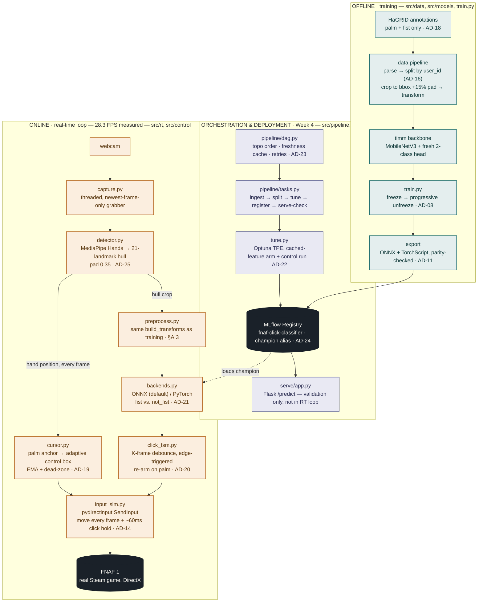

# Diagrams

Sensing-to-actuation system diagram: offline training pipeline, the Week-4
orchestration/deployment layer, and the online real-time loop that plays the
game. Reflects AD-25 (2026-07-28) — see
[architecture-and-decisions.md](../architecture-and-decisions.md) for the full
decision record.

- [architecture-diagram.html](architecture-diagram.html) — standalone designed
  page (legend, the §A.3 train/serve contract, and the key-decisions table).
  Open directly in a browser, no server needed.
- [architecture-diagram.mmd](architecture-diagram.mmd) — raw Mermaid source
  used by the page above; edit this and re-paste into the `<pre class="mermaid">`
  block in the HTML to keep both in sync.
- [flows.md](flows.md) — four zoomed-in flow diagrams for pieces that are a
  single box above but have real internal logic: the click FSM (AD-20), the
  cursor mapper (AD-19), one frame's trip through the real-time loop
  (Strategy 3.2.3's threaded capture), and the offline training/export
  pipeline (AD-08, AD-11, AD-16). Plain Mermaid-in-Markdown, no HTML page —
  see the top of that file for why.

Rendered directly below from the same source (GitHub renders Mermaid natively
in Markdown):

