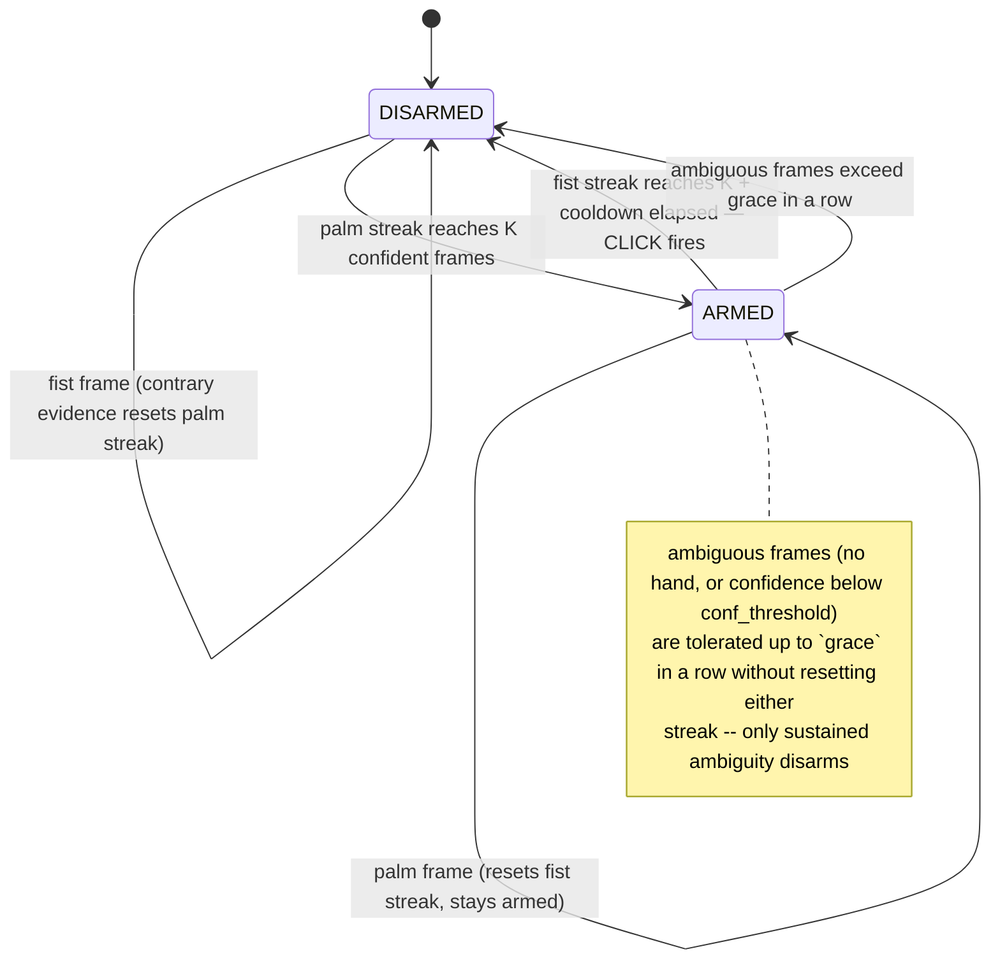
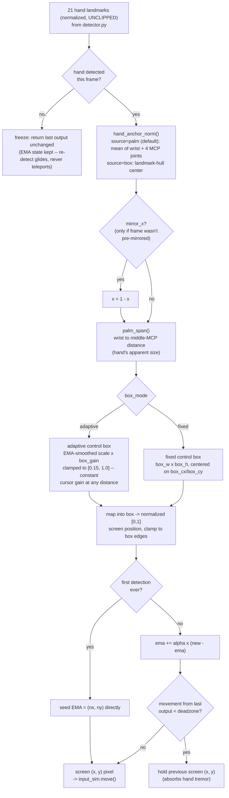
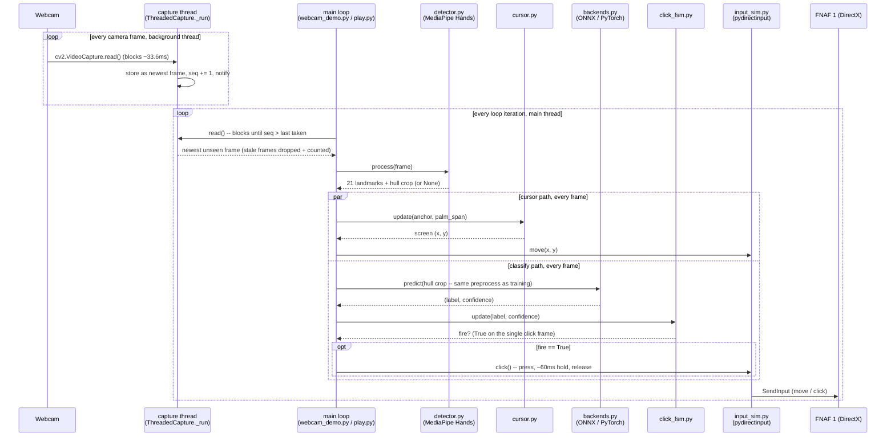
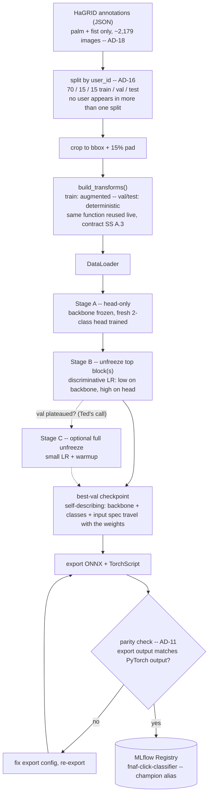

# Flow diagrams

Four diagrams that zoom into pieces of the [system diagram](README.md) that
are single boxes there but have real internal logic worth seeing on their
own: the click state machine, the cursor mapper, one frame's trip through
the real-time loop, and the offline training/export pipeline. Kept as plain
Mermaid-in-Markdown (GitHub renders it natively) rather than a styled HTML
page like the system diagram — four pages would multiply the manual
mmd-to-HTML sync the [README](README.md) already flags as a cost, for
diagrams that change with the code more often than the overall architecture
does.

Source: [`src/control/click_fsm.py`](../../../src/control/click_fsm.py),
[`src/rt/cursor.py`](../../../src/rt/cursor.py),
[`src/rt/capture.py`](../../../src/rt/capture.py), [`src/train.py`](../../../src/train.py).
If a diagram and the code disagree, the code is right — update the diagram.

## Click FSM — palm/fist → single click (AD-20)

Debounced, edge-triggered: a click fires on the one frame a confirmed
palm→fist transition completes, never on a held fist. Re-arming requires
seeing palm again, which makes double-fires structurally impossible rather
than just debounced. The `grace` window (Strategy 3.1.1) exists because
disarming on the *first* ambiguous frame made a slow squeeze physically
unclickable — the in-between poses read as low-confidence and cancelled the
armed state before the finished fist could fire.

K, `conf_threshold`, `cooldown_s`, and `grace` are live-tuning calls (CLAUDE.md) — see `describe()` in `click_fsm.py` for the HUD readout used to tune them.

## Cursor mapping — hand position → screen pixel (AD-19)

Runs every frame in parallel with the classify path. Anchor and box size are
computed independently of each other so a click squeeze (which moves
fingertips a lot) doesn't lurch the cursor, and so the same physical arm
motion moves the cursor the same amount regardless of distance from the
camera (Strategy 3.1.1's motion-invariance goal).

## One frame, real-time loop (Strategy 3.2.3)

`ThreadedCapture` runs the blocking camera read (~33.6 ms measured, DSHOW
640x480) on its own thread and keeps exactly one slot: the newest frame. The
main loop never waits on the camera longer than it takes a fresher frame to
arrive, and it never processes a stale one — frames it was too slow to take
are dropped and counted (`dropped` on the HUD). Cursor and classify are
independent per-frame paths that both come off the same detection.

## Offline training and export (AD-08, AD-11, AD-16)

Progressive unfreezing is the core learning objective (AD-08): establish how
much the pretrained backbone already carries before adapting deeper layers.
Stage C is optional and is Ted's call, made by watching the val curve, not
an automatic step.

