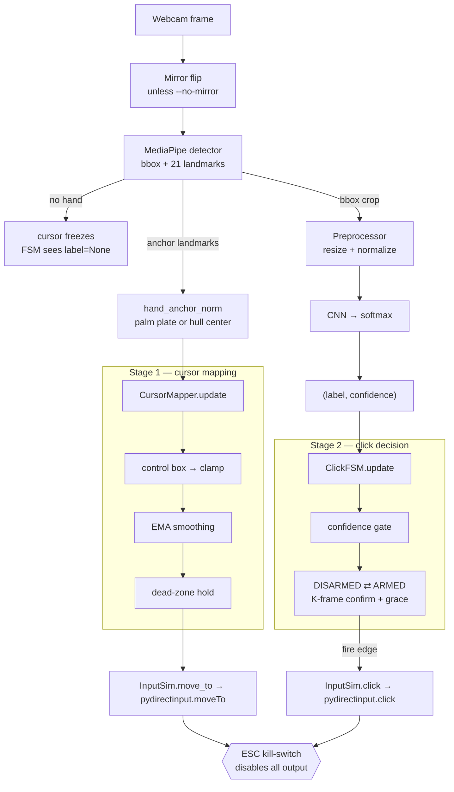

# Controller & Calibration — from model prediction to a click in the game

A reference for the **runtime control layer** shared by every Strategy-3 variant
(3.0 → 3.1 → 3.1.1 → 3.2). The strategy docs cover *what changed and why*; this
one answers a narrower, practical question:

> **Given a webcam frame, how does a model prediction become a real cursor move
> and a real mouse click in FNAF — and which knob do I turn when it feels wrong?**

Everything here lives in four modules, composed by one loop:

| Stage | Module | Turns … into … |
|---|---|---|
| Detect + track | [`src/rt/detector.py`](../../../../src/rt/detector.py) | frame → hand bbox + 21 landmarks |
| **Cursor** (stage 1) | [`src/rt/cursor.py`](../../../../src/rt/cursor.py) (AD-19) | landmarks → screen pixel `(x, y)` |
| **Classify** | crop → CNN → softmax | crop → `(label, confidence)` |
| **Click** (stage 2) | [`src/control/click_fsm.py`](../../../../src/control/click_fsm.py) (AD-20) | `(label, conf)` stream → one click edge |
| OS input | [`src/control/input_sim.py`](../../../../src/control/input_sim.py) (AD-14/17) | `(x, y)` / click → real Windows input |
| Compose | [`src/control/play.py`](../../../../src/control/play.py) (AD-17) | the per-frame loop that wires it all |

---

## The whole chain in one picture



Two branches run off the *same* detection every frame and stay independent: the
hand's **position** drives the cursor; a **crop of the hand** drives the click.
They only meet at the OS — a click always lands wherever the cursor currently is.

---

## Stage 0 — detect, mirror, crop

Per frame ([`play.py:190-208`](../../../../src/control/play.py#L190-L208)):

1. **Grab + mirror.** The frame is flipped horizontally so landmark *x* increases
   to the player's right (`--no-mirror` turns this off and tells the mapper to
   compensate). **The preview overlay and the mapper must agree on mirroring or
   the cursor moves backwards** (AD-19).
2. **Detect.** MediaPipe returns a padded hand bbox (`box_px`) and 21 **unclipped**
   normalized landmarks. No hand → the cursor freezes and the classifier is
   skipped for the frame.
3. **Crop.** For a `bbox` checkpoint the classifier sees `detector.crop(frame, hb)`
   — the same padded crop it trained on (AD-04 crop contract). A `full_frame`
   checkpoint gets the whole frame; the detector still runs, only for the cursor.

The cursor **needs** the detector — there is no ROI fallback here (unlike the
webcam demo). If MediaPipe can't find the hand, nothing moves.

---

## Stage 1 — prediction-of-position → cursor pixel

The "model prediction" for the cursor is MediaPipe's landmark set, not the CNN.
[`CursorMapper.update`](../../../../src/rt/cursor.py#L137-L173) turns it into a
screen pixel through a fixed chain (each step is a calibration surface):

```
anchor point → (mirror) → control box → clamp → EMA → dead-zone → screen (x, y)
```

- **Anchor** (`hand_anchor_norm`, `--anchor palm|box`). One point in unclipped
  normalized frame coords. `palm` = mean of wrist + four finger-base landmarks
  (ids 0,5,9,13,17); it barely moves during the palm→fist squeeze, so **clicking
  doesn't lurch the cursor**. `box` = center of the landmark hull (simpler, dips
  slightly when fingers curl). Using *unclipped* landmarks is the 3.1 fix — a
  clipped anchor drifts toward frame center when the hand is close/large.
- **Control box.** A central sub-rectangle of the frame maps to the *full*
  screen, so the hand reaches every screen edge without leaving the camera's
  comfortable FOV. Positions outside the box **clamp** to its edge.
  - **Adaptive** (`--box-mode adaptive`, default, 3.1.1): box width = `box_gain ×
    palm_span`, so cursor *gain* is constant across distance — the same arm
    motion moves the cursor the same amount whether the hand is near or far.
  - **Fixed** (`--box-mode fixed`, 3.1): box is a constant `box_w × box_h`
    fraction of the frame.
  - Position-invariance and motion-invariance are **mutually exclusive** once
    distance changes; adaptive deliberately chooses motion-invariance (what the
    live tests wanted).
- **EMA** (`--cursor-alpha`). Exponential smoothing; `alpha` is the weight of the
  *new* sample. Higher = more responsive/jittery, lower = steadier/laggier.
- **Dead-zone** (`--deadzone`). Holds the output pixel still while the smoothed
  target stays within `deadzone` (normalized screen units), killing hand tremor.
  The EMA keeps integrating underneath, so a slow deliberate drift still gets
  through once it accumulates — it damps buzz without freezing intent.
- **No hand → freeze.** `update(None)` returns the last pixel unchanged and
  **keeps** the EMA state, so on re-detection the cursor *glides* to the new spot
  instead of teleporting.

Output is an integer **true-pixel** screen coordinate (DPI-aware, see Stage 3).

---

## Stage 2 — CNN prediction → click edge

The CNN gives a per-frame `(label, confidence)` from a softmax over exactly two
classes (one of them `fist`). That noisy stream must become **one** deliberate
click. [`ClickFSM`](../../../../src/control/click_fsm.py) is the debounce.

**Decided semantics (Ted, 2026-07-14): one click per fist.** Each confirmed
palm→fist transition fires exactly once; holding the fist does nothing more until
the hand returns to the no-click pose and re-arms.

```
DISARMED ── 3 confident no-click frames ──▶ ARMED ── 3 confident fist frames ──▶ fire once
    ▲                                          │                                    │
    └──── ambiguity sustained past 10 frames ──┘◀───────────────────────────────────┘
          (brief low-conf / dropout frames             (re-arm requires no-click again)
           are tolerated, not a disarm)
```

Why this exact shape (AD-20). Values below are the code defaults in
[`ClickFSM`](../../../../src/control/click_fsm.py) and `play.py`'s CLI flags —
Ted's live-tuning calls, not fixed constants:

- **Confidence gate** (`--fsm-conf`, default **0.70**). A frame only counts if
  `confidence ≥ 0.70`. Below it, the frame is *ambiguous* — it neither confirms
  nor resets.
- **K-frame confirm** (`--fsm-k`, default **3**). Need 3 consecutive confident
  frames of a pose to accept it, so **one noisy frame can never click**.
- **Re-arm on no-click only.** After firing, the FSM won't fire again until it
  has *seen* 3 confident no-click frames. Double-fires are **structurally
  impossible**, not merely debounced.
- **Grace window** (`--fsm-grace`, default **10 frames**, 3.1.1). Ambiguous
  frames (low confidence or a brief detection dropout) don't hard-disarm — they
  just don't count, and ARMED survives up to 10 of them in a row. This fixed
  the bug where a *slow* palm→fist was physically unclickable: the in-between
  poses read low-confidence, the old FSM disarmed mid-squeeze, and the finished
  fist had nothing to fire from. Firing still requires 3 confident fist frames
  — grace only stops uncertainty from *cancelling* an armed squeeze.
- **Sustained absence still disarms.** More than 10 consecutive ambiguous
  frames drops to DISARMED, so a hand that actually left can't return as a
  surprise click.
- **Cooldown** (`--cooldown`, default **0.30 s**). A pure backstop (min 0.30 s
  between fires) against classifier flicker; the no-click re-arm is the real
  guard.

`update()` returns `True` on the single frame the click should fire. The
no-click label is **checkpoint-derived** — `"palm"` for the palm/fist model
(AD-18), `"not_fist"` for fist-vs-rest (AD-21). Any other label (e.g. from a
legacy 8-class model) counts as "neither" and disarms.

---

## Stage 3 — into the real game

[`InputSim`](../../../../src/control/input_sim.py) wraps `pydirectinput`
(SendInput — the known-good path for DirectX games; `pyautogui` clicks may not
register in FNAF). Three non-obvious setup facts, all learned on day-1 de-risking:

- **DPI awareness.** `SetProcessDPIAware()` runs before any movement so all
  coordinates are *true* pixels; `screen_size()` reports the same space. Without
  it, a scaled display makes `moveTo` land in the wrong spot.
- **`PAUSE = 0`.** `pydirectinput`'s default 0.1 s sleep per call would cap the
  loop at ~10 FPS. The frame loop is the clock instead.
- **`FAILSAFE = False`.** The corner-slam failsafe would constantly trigger with
  a cursor the *player's hand* is steering. ESC is the kill-switch instead.

**Kill-switch (mandatory, CLAUDE.md).** `kill()` flips one flag checked by every
output call; nothing re-enables it for the life of the process. It's wired two
ways in [`play.py`](../../../../src/control/play.py#L87-L97): a global `keyboard`
hotkey so **ESC works even while FNAF has focus**, and the preview window's `q`/ESC
key. `--dry-run` runs the full pipeline but sends *no* OS input — always sanity-
check tracking and clicks in dry-run before going live.

---

## Calibration — the knobs and how to set them

Every tuning value is a `play.py` CLI flag. The defaults are the Strategy-3
starting points; **the live values are Ted's calls** (CLAUDE.md defers cursor and
FSM tuning to the human). Recommended order: get the cursor feeling right first
(dry-run), then tune clicks, then go live.

### Cursor feel (Stage 1)

| Flag | Default | Raise it when… | Lower it when… |
|---|---|---|---|
| `--anchor` | `palm` | (A/B) cursor lurches on click → keep `palm` | try `box` if palm anchor drifts oddly |
| `--box-mode` | `adaptive` | — | use `fixed` only to reproduce 3.1 behavior |
| `--box-gain` | `4.0` | cursor too **slow** / can't reach edges | cursor too **twitchy** / overshoots |
| `--box-w` / `--box-h` | `0.60` / `0.55` | (fixed mode) hand can't reach screen edges → smaller box = higher gain | reaching edges too easily → larger box |
| `--cursor-alpha` | `0.35` | cursor feels **laggy** / rubber-banded | cursor **jitters** / buzzes |
| `--deadzone` | `0.005` | resting hand still **buzzes** the cursor | can't make **small** deliberate moves |

Adaptive mode: tune **gain**, not the box fractions. `box_h/box_w` only fixes the
box *aspect* in adaptive mode.

### Click feel (Stage 2)

| Flag | Default | Raise it when… | Lower it when… |
|---|---|---|---|
| `--fsm-k` | `3` | getting **false clicks** from brief flickers | fists feel **hard to trigger** / laggy |
| `--fsm-conf` | `0.70` | non-fist poses still **fire clicks** | real fists **fail to register** |
| `--fsm-grace` | `10` | a hand that **left** still fires a late click | **slow squeezes** get cancelled mid-way |
| `--cooldown` | `0.30` s | one squeeze fires **twice** | rapid intentional clicks **feel throttled** |

`--fsm-conf` should match the number used in the open-set false-click evaluation
(0.70) so the offline metric predicts live behavior. If false clicks persist at a
sane conf gate, that's a **model** problem, not an FSM one — that's exactly what
Strategy 3.2 (`not_fist` negative class) exists to fix; retrain rather than crank
`K` and `conf` to paper over it.

---

## Day-1 registration check (plan.md Step 5)

Non-negotiable first live test — FNAF is DirectX, so movement and clicks must be
*verified* to register, not assumed:

```bash
# 1. Dry-run: full pipeline, no OS input — check tracking + click detection on the HUD
python -m src.control.play --checkpoint models/fistvsrest_frozen_mnv3_large/best.pt --dry-run

# 2. Live against the game
python -m src.control.play --checkpoint models/fistvsrest_frozen_mnv3_large/best.pt
```

With FNAF focused, confirm **(1)** the cursor moves smoothly in-game and **(2)** a
fist click lands on a door button. If moves/clicks don't register: try
windowed/borderless FNAF and run the terminal as admin (troubleshooting notes in
`keyboard_mock_controller.py`). **ESC = kill-switch** the entire time.

The HUD shows the live control box, hand bbox, virtual cursor cross, the current
`(label, confidence)`, the FSM state + streak counters (`fsm.describe()`), FPS,
click count, and mode (`DRY-RUN` / `LIVE` / `KILLED`) — read the FSM streaks when
a click won't fire to see whether it's a confidence, `K`, or arming problem.

---

## Related

- **Cursor mapping rationale** → [3.1](03.1-distance-invariant-cursor.md), [3.1.1](03.1.1-live-robustness-fixes.md)
- **Click classifier / false-click metric** → [3.2](03.2-fist-vs-rest.md)
- **Decisions**: AD-04 (two-stage), AD-14/17 (input sim), AD-18/21 (classes), AD-19 (cursor), AD-20 (FSM) → [architecture-and-decisions.md](../../architecture-and-decisions.md)
- **The loop itself** → [`src/control/play.py`](../../../../src/control/play.py)
