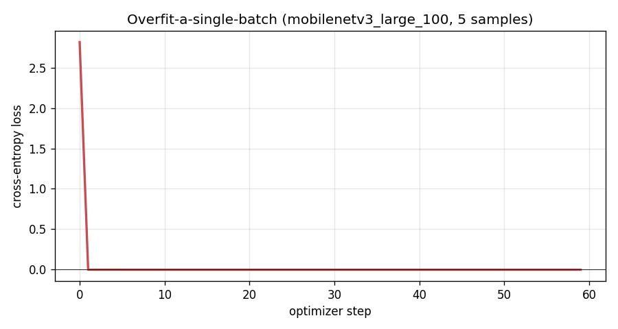
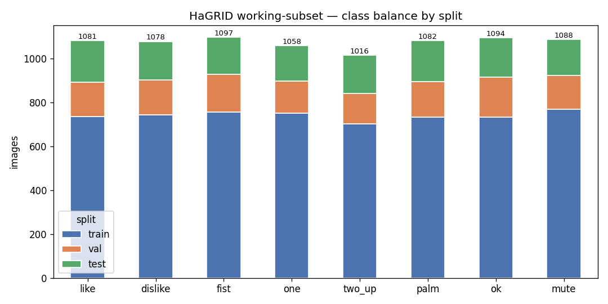
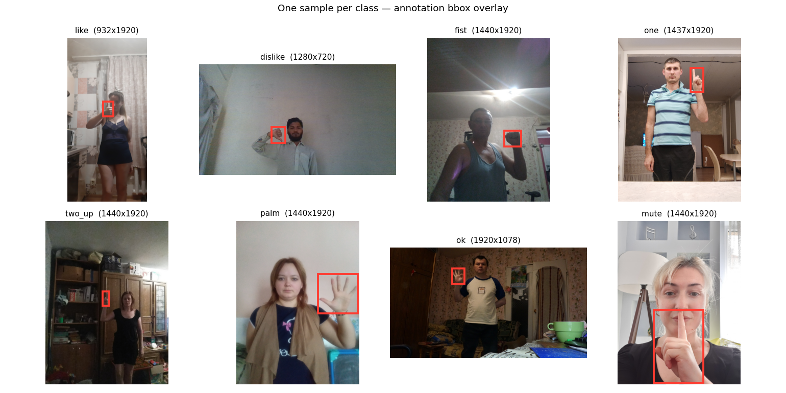
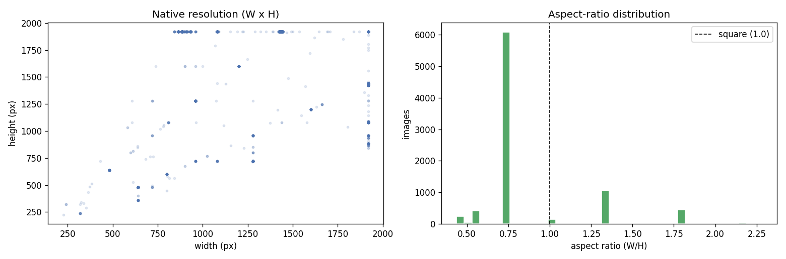
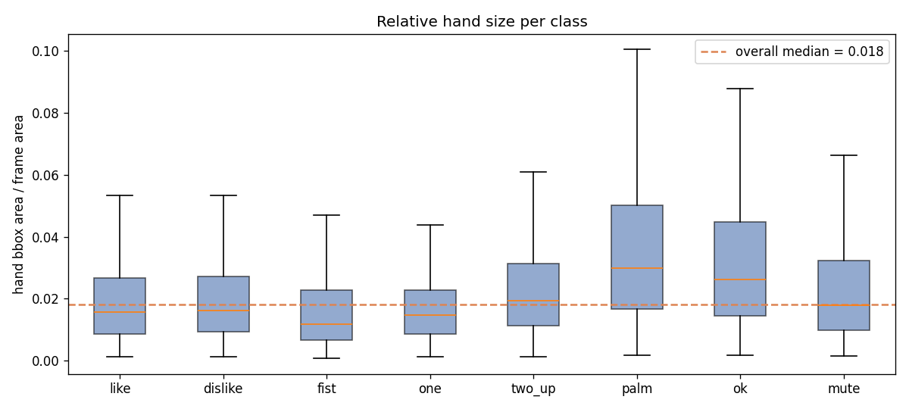

# Week 2 — Data Understanding Report
### Gesture-Controlled FNAF · HaGRID hand-gesture subset

> **Living document.** This report validates the dataset and preprocessing that
> every later modeling decision rests on. Its executable companion is
> [`eda-notebook.ipynb`](eda-notebook.ipynb) — every figure and number here is
> produced by running the project's **real** pipeline (`src/data/*`) over the
> images actually on disk; nothing is mocked. Deeper mechanics live in
> [data.md](../data.md) (provenance), [data-preparation.md](../data-preparation.md)
> (pipeline), and [architecture-and-decisions.md](../architecture-and-decisions.md)
> (the `AD-NN` decisions cited throughout).

**Headline:** the working set is **8594 usable images** across **8 control
gesture classes** from **4124 distinct subjects**, **100% readable out of the
box**, split **70/15/15 by user** (train 5919 / val 1273 / test 1402). The
pipeline is validated end-to-end by an overfit-a-single-batch test (loss → 0).

---

## 1. Data Source & Ingestion

**Source.** [HaGRID](https://github.com/hukenovs/hagrid) (HAnd Gesture Recognition
Image Dataset, WACV 2024) — 18 static one-hand gesture classes. Two artifacts are
separate: **annotations** (per-class JSON: normalized-COCO bbox + 21 hand
landmarks + `user_id` per image UUID) ship in the repo (`DATA/ann_*`); **images**
are a separate multi-hundred-GB download.

**Access method — and the honest deviation from Week 1.** The Week-1 proposal
sketched a generic "scheduled download" ingestion. **HaGRID is a static, versioned
research dataset — there is no live feed to schedule and no update frequency**, so
an **Airflow DAG polling for new data would be theater, not engineering.** What the
data *actually* needed was a way to pull a controlled subset out of the 716 GB
release without ever storing it. The ingestion is therefore a **deterministic,
resumable acquisition pipeline** (`src/data/download_*.py`) that, conceptually, is
a linear DAG run **once**:

```
select UUIDs (per-class ann JSON, minus test UUIDs, seeded)
      → HTTP range-fetch only those {uuid}.jpg from the remote per-class ZIP
      → write to DATA/images/{set}/{class}/
      → MD5 dedup + identity audit (0 leaks / 0 dups asserted)
      → per-class download-count report
```

The range-request trick (`remotezip`) fetches only the specific JPEG entries we
need out of each 25–63 GB ZIP — no intermediate archive is ever stored. Both
scripts are deterministic for a given `--seed` (42) and idempotent: re-running
`download_train_val.py --no-download` re-runs just the dedup audit. Full mechanics:
[data.md](../data.md).

**Update frequency.** None — one-time acquisition. The dataset is frozen; the
*split* over it is a pure function of `(file set, seed)`, so "ingestion" is
reproducible rather than recurring.

**Surprises / changes since Week 1.**
- **No scheduled ingestion needed** (above) — replaced with a resumable
  range-request downloader.
- **Version drift in the annotation snapshot.** 206 annotated UUIDs (~2.3% of the
  8800 targeted) `KeyError` out of the current remote ZIPs — the `ann_*` snapshot
  is slightly newer than the published image release. Not recoverable by
  re-running; documented per class in [data.md](../data.md). Final on-disk count:
  **8594**.
- **The split design changed** (see §5 / [data-preparation.md](../data-preparation.md)):
  the original "subsample folder = test set" plan was retired in favor of pooling
  both download folders and re-splitting **70/15/15 grouped by `user_id`** — an
  honest generalization test with no subject leakage (AD-10, AD-16).

---

## 2. Data Profile

*(All values from [`eda-notebook.ipynb`](eda-notebook.ipynb), computed over the
files on disk.)*

| Property | Value |
|---|---|
| Total usable images | **8594** |
| Classes (control subset, AD-03) | `like, dislike, fist, one, two_up, palm, ok, mute` |
| Distinct subjects (`user_id`) | **4124** (median 1 image/subject) |
| Images with a hand bbox | **8594 / 8594 (100%)** |
| Native resolution (median) | **1440 × 1920 px (~2.76 MP)** |
| Resolution range | 225×225 → 1920×1920 (mean 1429 × 1746) |
| Orientation | **79.4% portrait**, 20.6% landscape/square |
| Corrupt / unreadable JPEGs | **0 (0.00%)** |
| **Usable out of the box** | **100.00%** |

**Per-class counts (rows sum to 8594):**

```
label     train   val  test  total
like        736   157   188   1081
dislike     742   160   176   1078
fist        755   172   170   1097
one         751   146   161   1058
two_up      701   139   176   1016
palm        733   161   188   1082
ok          732   183   179   1094
mute        769   155   164   1088
TOTAL      5919  1273  1402   8594
```

**Missing values, duplicates, anomalies — and how they were handled.**
- **Missing images (upstream):** 206 targeted UUIDs never came out of the remote
  ZIPs (version drift, §1). Handled by **indexing files, not annotations** —
  `build_full_index()` walks the JPEGs on disk and joins each to its record, so a
  missing image is simply absent, never a null row. No imputation is possible or
  appropriate (you cannot invent an image); the honest response is to report the
  final counts, which we do.
- **Missing annotations (in-set):** validating the 8 classes surfaces **6 records
  labelled only `no_gesture`** (a second, non-gesturing hand). None correspond to a
  downloaded training image, so they never enter a split
  ([data-preparation.md](../data-preparation.md) §2).
- **Duplicates:** guarded at three levels — unique UUID keys within a folder, the
  downloader removes every `ann_subsample` UUID from the `train_val` pool, and a
  full **MD5 pass** across all 8594 images. Last audit: **0 content-duplicate
  leaks, 0 intra-set duplicates.**
- **Corrupt files:** every image is opened and `verify()`-ed in the notebook —
  **0 corrupt/truncated JPEGs**, so no load-time skipping is needed.

**Key statistical summaries (most important features).**
- *Class balance* — max/min ratio **1.08×** (largest `fist` 1097, smallest
  `two_up` 1016). Effectively balanced → plain cross-entropy, no class weighting.
- *Resolution* — tightly clustered at 1440×1920; min 225×225 still ≥ the 224²
  model input, so the resize never has to invent detail.
- *Relative hand size* — **median hand bbox = 1.8% of frame area**; **87.9% of
  images put the hand under 5% of the frame.** This is the most consequential
  statistic in the dataset (see §4, Viz 4).

**Reported final counts (rubric — vision).** Total images **8594**; spatial
dimensions predominantly **1440×1920×3** native, standardized to **224×224×3**
tensors for the model; 8 classes; 4124 subjects.

---

## 3. Classical ML / Tabular — *not applicable*

This is a **deep-learning image-classification** project (transfer-learned CNN),
not tabular ML. There is no missing-value imputation, categorical encoding, or
feature-engineering step in the tabular sense — the "features" are learned by a
pretrained backbone. The equivalent concerns (missingness, duplicates, encoding of
the label space, feature scaling) are handled in §2 and §4. Proceeding to §4.

---

## 4. Deep Learning / Unstructured Data

### 4.1 Ingestion pipeline architecture (storage → GPU)

Config-driven (`configs/data.yaml`) and implemented in `src/data/`. Path:

```
configs/data.yaml
   → build_full_index()   scan DATA/images/** ⨝ DATA/ann_** → one DataFrame (uuid,label,path,bbox,user_id)
   → make_splits()        70/15/15 grouped by user_id, seed 42 (no subject leakage)
   → HagridDataset        open → bbox-crop (+15% pad) → transform → (tensor 3×224×224, label_idx)
   → DataLoader           batch=64, shuffle=train only
```

The batching/shuffling and the `(image, label)` contract are the real code:

```python
# src/data/dataset.py  — the Dataset the GPU pulls from
class HagridDataset(Dataset):
    def __getitem__(self, i):
        row = self.index.iloc[i]
        img = Image.open(row["path"]).convert("RGB")
        if self.crop_mode == "bbox":                 # two-stage detect-and-crop (AD-04)
            img = self._crop_to_bbox(img, row["bbox"])
        return self.transform(img), int(row["label_idx"])

# build_dataloaders(): shuffle=True for train, False for val/test; batch_size=64 (8 GB VRAM budget)
loaders["train"] = DataLoader(ds["train"], batch_size=64, shuffle=True,
                              num_workers=4, pin_memory=True)
```

**Batching:** fixed `batch_size: 64` (tuned to the 8 GB RTX 4060 budget, AD-02b),
`num_workers: 4`, `pin_memory: true`. **Shuffling:** train only; val/test stay
ordered so metrics are reproducible. Full walkthrough:
[data-preparation.md](../data-preparation.md).

### 4.2 Data transformation & standardization (2D vision)

- **Spatial resizing:** `resize` → `center-crop` to a fixed **224 × 224** square
  (the resize-then-crop ratio handles the two orientation clusters from Viz 3
  without squashing hand shape). Input size is taken from the **backbone's own
  timm `data_config`**, so it always matches what the pretrained network expects
  (AD-06).
- **Cropping (the key spatial choice):** `crop_mode: bbox` crops to the annotated
  hand + 15% padding *before* resizing, so the gesture fills the tensor instead of
  drowning in background (justified by Viz 4). The live loop mirrors this with a
  MediaPipe hand detector — **preprocessing must match train↔runtime byte-for-byte**
  (AD A.3), the most common cause of "great test accuracy, useless live."
- **Normalization:** per-channel `(x/255 − mean) / std` using the backbone's
  ImageNet stats (`mean=[0.485,0.456,0.406]`, `std=[0.229,0.224,0.225]`).
- **Augmentation (train split only, AD-09):** random-resized-crop, horizontal flip
  (**label-safe for this 8-class subset** — no class has a mirror partner in it),
  small rotation/translation, and color jitter to close the webcam-lighting gap.
  Val/test/runtime use the deterministic eval pipeline.

*(The text-specific items — tokenization, padding, max sequence length,
truncation % — do not apply to an image project.)*

### 4.3 The "overfit a single batch" test

**Purpose:** prove the whole path (index → crop → transform → tensor → `timm`
MobileNetV3 → loss → backprop → weight update) works *before* a real run. A
network that cannot memorize a handful of images has a pipeline bug (label
misalignment, detached graph, signal-erasing normalization).

**Setup:** 5 samples, one from each of the first 5 classes
(`like, dislike, fist, one, two_up`), the **exact eval preprocessing** the real
training uses, `mobilenetv3_large_100` unfrozen, Adam `lr=1e-3`, 60 steps.

**Result:** loss collapses from ≈ln 8 (2.08, random) to **0.0000**, batch accuracy
**100%**.



The network drives its own loss to zero through the real pipeline → **pipeline
validated.** This is a capacity/plumbing check only; it says nothing about
generalization (measured by the held-out numbers in Phase 2/3).

### 4.4 EDA visualizations *(full analysis in the notebook)*

**Viz 1 — Class balance by split.** 
Near-balanced (1.08× ratio); every class populated in val (≥139) and test (≥161),
so per-class metrics will be trustworthy. No resampling/weighting needed.

**Viz 2 — Bbox overlays (one sample/class).** 
Confirms the UUID→file→annotation join and the normalized-COCO→pixel conversion
are correct; visually shows the hand is a small part of each frame.

**Viz 3 — Resolution & aspect ratio.** 
Two orientation clusters (79% portrait) → justifies the square resize-then-crop
rather than a distorting squash; min 225px ≥ 224 input, so no risky upsampling.

**Viz 4 — Relative hand area *(the finding that shaped the model)*.**

Median hand = **1.8%** of the frame; **87.9%** under 5%. A frozen ImageNet backbone
recognizes whole frame-filling objects, not a tiny hand adrift in background —
which is exactly why the Phase-2 **full-frame baseline stalled at 53% test**
([results.md](../results.md)). This distribution is the empirical basis for
**AD-04's two-stage detect-and-crop** (`crop_mode: bbox`), confirmed — not
assumed — by a controlled Phase-3 A/B.

**Findings that revised the approach.** Viz 4 + the 53% full-frame baseline moved
the primary preprocessing from full-frame to **crop-then-classify** and added a
**MediaPipe hand detector** to the live loop (AD-04). Nothing in the EDA
challenged the 8-class control subset (AD-03) or the by-user split (AD-10).

---

## 5. Revised Core Requirements & Schedule

Data is validated, so the Week-1 requirements are re-affirmed with the changes the
data forced. These stay **granular / specific / measurable**. The living,
detailed plan is [implementation-plan.md](../implementation-plan.md); the
week-by-week mapping is [schedule.md](../schedule.md).

| # | Core requirement (measurable) | Status vs. Week 1 |
|---|---|---|
| R1 | Classify **8 static gestures** (`like…mute`) from a single RGB frame | unchanged (AD-03) |
| R2 | Preprocessing: **two-stage detect-and-crop** (bbox +15% pad → 224²), identical train↔runtime | **revised** — was full-frame; changed on Viz-4 + baseline evidence (AD-04) |
| R3 | Honest eval: **70/15/15 split grouped by `user_id`**, no subject leakage | **revised** — was subsample-as-test (AD-10/AD-16) |
| R4 | Transfer learning: pretrained `timm` backbone, fresh head, freeze → progressive unfreeze | unchanged |
| R5 | **Test accuracy ≥ 90%** on the 8-class held-out (by-user) test set | unchanged (Week-3 DoD) |
| R6 | Real-time loop **≥ 15 FPS**, temporal smoothing + debounce, MediaPipe crop | unchanged; MediaPipe now firmly in scope (R2) |
| R7 | Drive **real FNAF 1** via `pydirectinput`; **global kill-switch**; input registration verified early | unchanged |
| R8 | Full **hands-free Night 1** playthrough on video | unchanged (Week-5 DoD) |

**Schedule note.** The repo's five phases map 1:1 to the five weeks in
[schedule.md](../schedule.md); the only substantive schedule change is that the
**MediaPipe hand-crop moved from a contingency to a planned Phase-3/4 component**
(driven by R2). Milestones and "behind-schedule" trip-wires are unchanged.

---

## 6. Context Files (Week-2 status)

| Rubric file | This repo | Status |
|---|---|---|
| `claude.md` (AI context) | [DOCS/Claude.md](../Claude.md) (plan) + [root `CLAUDE.md`](../../CLAUDE.md) (agent guardrails) | maintained; Week-2 cadence note added |
| `ai-usage-log.md` | [DOCS/AI-usage.md](../AI-usage.md) | **Week-2 entry added** |
| `implementation-plan.md` | [DOCS/implementation-plan.md](../implementation-plan.md) | **finalized this week** |
| `schedule.md` | [DOCS/schedule.md](../schedule.md) | requirements ↔ weeks mapping current |

> Filenames differ slightly from the rubric's lowercase names because this repo
> predates the naming convention and Windows' case-insensitive filesystem forced
> the `CLAUDE.md`/`Claude.md` split (agent-context vs. AI-usage-plan). Contents
> satisfy every required file; this table is the crosswalk.
