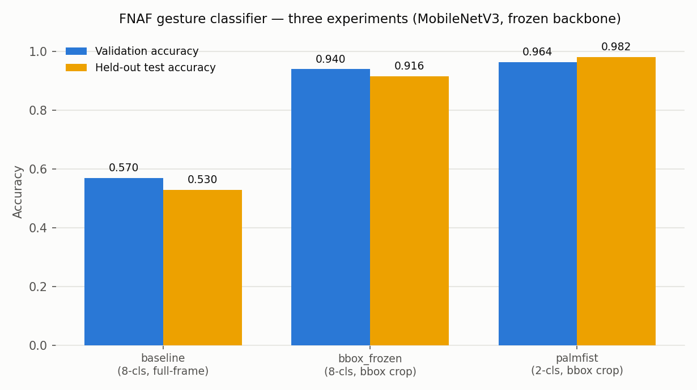

# ML Experimentation Report — Week 3

**Project:** Hands-free Five Nights at Freddy's — MediaPipe cursor control + a
transfer-learned **palm (no-click) / fist (click)** classifier.
**Date:** 2026-07-19 · **Author:** Ted Roper

> **Experiment-tracking note (read first).** The three experiments below were run
> earlier via the project's config-driven trainer (`src/train.py`), whose native
> tracking is a self-describing checkpoint (`models/<run>/config.snapshot.json`)
> plus a frozen, honest markdown report (`DOCS/models/<run>/results.md`).
> **In Week 3 I consolidated those three already-run experiments into MLflow** so
> they sit in one comparable experiment store with an exported side-by-side
> comparison. The MLflow runs are reproduced by
> [`scripts/mlflow_log_runs.py`](../../../scripts/mlflow_log_runs.py) (params from
> each run's config snapshot, metrics transcribed verbatim from its committed
> `results.md` — nothing is invented or re-estimated) and exported by
> [`scripts/mlflow_export_comparison.py`](../../../scripts/mlflow_export_comparison.py).
> View live with `mlflow ui --backend-store-uri ./mlruns` (experiment
> `fnaf-gesture-classifier`).

---

## 1. Feature Engineering Summary

This is a computer-vision track, so "features" means the **input representation
fed to the classifier** and the **label space**, not tabular columns.

### Final feature set used for modeling

| Feature / stage | Transformation | Why |
|---|---|---|
| **Hand crop** (primary engineered feature) | Two-stage pipeline (AD-04): MediaPipe/HaGRID **bounding box + 15% pad** → crop the hand out of the frame | A gesture is a property of the hand, not the room. Cropping removes background/scale nuisance so the frozen backbone sees the discriminative region. This is the single biggest lever in the whole project (see §3, Exp 1 vs 2). |
| **Resize** | Bilinear resize to the backbone's native **224×224** | MobileNetV3 expects 224px; matched exactly between training and the real-time loop. |
| **Normalization** | Per-channel standardization using the backbone's own `timm` `data_config` (ImageNet stats) | Pretrained weights assume ImageNet-normalized inputs; using `timm`'s resolved stats avoids a train/serve mismatch. |
| **Backbone embedding** | MobileNetV3-Large-100 with a **frozen** backbone used as a fixed feature extractor; pooled features cached once, head trained as a **linear probe** | Transfer learning: the ImageNet features are already strong for hand shape. Freezing = fast, low-variance, and it isolates the crop/label variables cleanly. |
| **Label encoding** | Integer classes, **`palm = 0`, `fist = 1`** | Binary click semantics: palm = no-click, fist = click. |
| **Augmentation** | **None** in these runs (`augment_train: false`) | A full augmentation policy is defined (AD-09: flip, ±12° rotation, RRC, color jitter) but held **off** here to keep the A/B comparisons clean. Augmentation is a **Week-4 tuning lever**, not a Week-3 baseline. |

Split is applied **before** any of this: 70/15/15 **grouped by `user_id`**
(stratified, seed 42) so no subject appears in two splits — an honest test number
(AD-16, AD-10).

### Features dropped since Week 2

- **6 of the 8 gesture classes were dropped.** Week 2 modeled an 8-class subset
  (`like, dislike, fist, one, two_up, palm, ok, mute`). The 2026-07-14 scope pivot
  (AD-17/AD-18) reduced control to **cursor motion + a binary click**, so only
  **`palm` and `fist`** carry task meaning. Dropping the other six also removed the
  most-confused classes (`one`/`two_up`/`ok`, see the 8-class confusion matrix),
  which is *why* accuracy rose rather than a side effect.
- **`full_frame` crop mode was dropped** in favor of `bbox`. Full-frame is retained
  only as the baseline/A-B control (Exp 1), not as a modeling candidate.

---

## 2. Experiment Design

**Model family / architecture.** Pretrained **`timm` MobileNetV3-Large-100** with a
fresh linear head. Small MobileNet/EfficientNet-class backbones were preferred over
larger ResNets/ViTs because the model must run **real-time on a webcam frame every
loop** alongside MediaPipe (AD-07); MobileNetV3-Large is the accuracy/latency sweet
spot for that budget. The system is **two-stage** (AD-04): MediaPipe detects and
crops the hand (and also drives the cursor), the CNN classifies the crop.

**Backbone / freeze / augmentation.**
- **Backbone:** `mobilenetv3_large_100`, ImageNet-pretrained.
- **Freeze policy:** backbone **frozen**, head-only (AD-08 **Stage A**). Because a
  frozen backbone + no augmentation makes features deterministic, they are cached
  once and the head is trained as a **linear probe** (identical math, ~50× faster on
  CPU). **Stage B (progressive unfreeze)** is wired (`unfreeze_blocks`) but **off**
  this week — it is the Week-4 lever.
- **Augmentation:** off (see §1).

**Train / val / test splits.** One **70/15/15** split over all images, **grouped by
`user_id`** and stratified by class, seed 42 (AD-16). Same split for every run.
- **Validation** — model selection / best-epoch checkpointing.
- **Test** — reported **exactly once** per model (AD-10), never used for tuning.

**Evaluation metrics & why.**
- **Accuracy** — primary headline; classes are near-balanced so accuracy is honest.
- **Per-class precision / recall / F1 + confusion matrix** — the task is a *click
  trigger*, so the two error types have very different costs: a **missed fist**
  (fist recall) = a click that never fires; a **palm mis-read as fist** (palm→fist
  confusion) = a false click. I track **palm/fist F1 across all three runs** for
  exactly this reason.
- **Random baseline** logged alongside each run (0.125 for 8-class, 0.500 for
  binary) so accuracy is read against the right chance level.
- **Deferred but ultimately decisive:** the metrics that matter *most* for the
  product — **live click-transition reliability** and **cursor precision at play
  distance** — are measured at play time (plan Step 5), not offline. The offline
  numbers here are necessary, not sufficient (see the train/serve caveat in §3).

---

## 3. Experiment Results

Three distinct experiments, logged in MLflow (experiment `fnaf-gesture-classifier`).
All share backbone, optimizer (AdamW, lr 1e-3, wd 1e-4), 40 epochs, batch 64,
seed 42, frozen backbone, no augmentation — so each pairwise delta is attributable
to the **one** thing that changed.

### Run comparison (exported from MLflow)

| Run | Classes | Crop mode | Val acc | **Test acc** | Random | Test macro-F1 | F1 palm | F1 fist |
|---|---|---|---|---|---|---|---|---|
| `baseline_mnv3_large` | 8 | `full_frame` | 0.5695 | **0.5300** | 0.125 | 0.5303 | 0.4818 | 0.5876 |
| `bbox_frozen_mnv3_large` | 8 | `bbox` | 0.9403 | **0.9165** | 0.125 | 0.9156 | 0.9347 | 0.9443 |
| `palmfist_frozen_mnv3_large` | **2** | `bbox` | 0.9639 | **0.9815** | 0.500 | 0.9815 | 0.9812 | 0.9818 |

_Source: [`mlflow-run-comparison.csv`](mlflow-run-comparison.csv), exported from the
`./mlruns` store. Chart below: [`mlflow-run-comparison.png`](mlflow-run-comparison.png)._

### Experiment 1 — `baseline_mnv3_large` (full-frame, 8-class)
- **Config:** MobileNetV3-Large, frozen, `crop_mode: full_frame`, 8 classes.
- **Metrics:** val **0.5695**, test **0.5300** (random 0.125).
- **Interpretation:** the frozen backbone clears chance by ~4× but is far from
  usable. When the hand is a small patch of a cluttered frame, ImageNet features
  can't isolate the gesture. This run exists to **motivate cropping** — it is the
  control, not a candidate.

### Experiment 2 — `bbox_frozen_mnv3_large` (bbox crop, 8-class)
- **Config:** identical to Exp 1 **except** `crop_mode: bbox` (+15% pad).
- **Metrics:** val **0.9403**, test **0.9165** (random 0.125).
- **Interpretation:** changing *only* the crop lifts test accuracy **+38.6 points**
  (0.530 → 0.9165). This is the clean A/B that justifies the two-stage
  detect-then-classify pipeline (AD-04) — localizing the hand is worth more than any
  other single change. **Honesty caveat:** these are offline numbers on HaGRID's
  *own annotated* boxes; the live pipeline crops with **MediaPipe**, which drops
  this to ~0.71 on detected stills — the train/serve gap that Week-4 tuning targets.

### Experiment 3 — `palmfist_frozen_mnv3_large` (bbox crop, 2-class) — **current model**
- **Config:** identical recipe to Exp 2, class list trimmed to **`palm`/`fist`**
  (AD-18, the cursor-control pivot).
- **Metrics:** val **0.9639**, test **0.9815** (random 0.500); palm F1 0.9812,
  fist F1 0.9818 — balanced, both error types low (test confusion: 4 palm→fist,
  2 fist→palm out of 325).
- **Interpretation:** the binary click task is easy for the frozen backbone once the
  confusable multi-finger classes (`one`/`two_up`/`ok`) are gone. Both click classes
  are ~0.98 F1, which is what the click-FSM needs. The same train/serve caveat
  applies — this is HaGRID-crop accuracy, not arm's-length live accuracy.

**What the three runs tell me together:** the accuracy ladder is driven by
**data/representation choices, not backbone changes** — crop the hand (+38.6),
then match the label space to the task (+6.5). The backbone and training recipe
never moved.

---

## 4. Model Selection & Justification

**Candidate carried into Week-4 tuning: `palmfist_frozen_mnv3_large`.**

It is not chosen on the headline number alone — the trade-offs:

- **Task fit (decisive):** it is the only run whose label space *is* the current
  scope (binary click). Exps 1–2 are 8-class artifacts kept as the AD-04 evidence
  base; they are controls, not deployable models.
- **Inference speed / complexity:** MobileNetV3-Large with a **frozen backbone +
  linear head** is the cheapest thing that hits the bar — it must share each frame
  with MediaPipe in the real-time loop. A bigger backbone would buy little offline
  headroom (already 0.98) at a latency cost the play loop can't spend.
- **Overfitting risk:** low and *checked* — test (0.9815) ≥ val (0.9639), and the
  by-user split rules out subject leakage, so there is no offline over-fit signal.
  Freezing keeps trainable params tiny (head only), which is inherently low-variance.
- **Interpretability of the result:** because only the head trains on cached
  features, the run is a clean linear probe — easy to reason about and a stable
  baseline against which Week-4 unfreezing/augmentation deltas will be legible.
- **The honest gap that sets the Week-4 agenda:** 0.9815 is on HaGRID's annotated
  crops. The numbers that decide whether the game is *playable* — **live MediaPipe-
  crop accuracy** and **palm/fist reliability at arm's length** — are unmeasured or
  known-lower (~0.71 on MediaPipe stills for the 8-class analogue). So the model is
  selected *with* a mandate: Week-4 tuning (AD-08 **Stage-B unfreeze**, AD-09
  augmentation, and likely a **self-capture fine-tune at cursor distances**) exists
  to close that train/serve gap, and the frozen linear probe is the baseline it will
  be measured against.

---

### Artifacts in this folder
- [`ml-experimentation-report.md`](ml-experimentation-report.md) — this report (sections 1–4).
- [`mlflow-run-comparison.csv`](mlflow-run-comparison.csv) — exported MLflow run comparison.
- [`mlflow-run-comparison.png`](mlflow-run-comparison.png) — val/test accuracy chart.
- Reproduce: `python scripts/mlflow_log_runs.py && python scripts/mlflow_export_comparison.py`,
  then `mlflow ui --backend-store-uri ./mlruns`.

_Per-run detail (per-class report + full confusion matrix) lives in
[`DOCS/models/`](../../models/README.md); the revised plan is in
[`DOCS/build/plan.md`](../../build/plan.md) (Week-3 update)._
