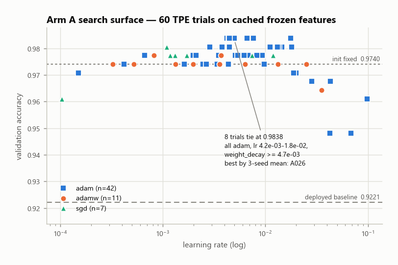
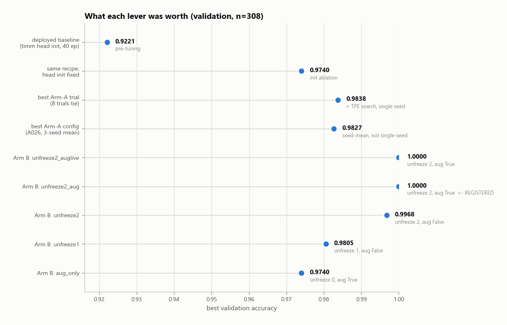
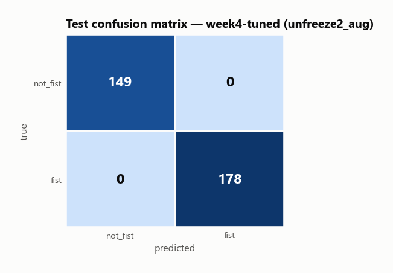
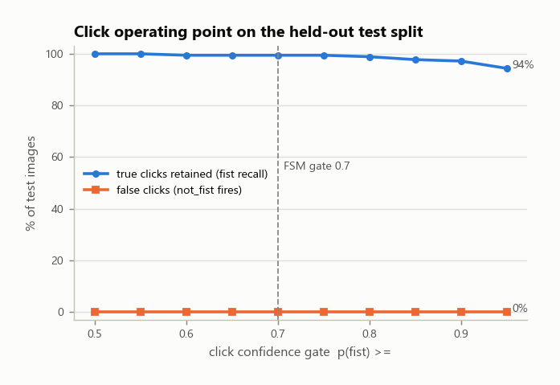
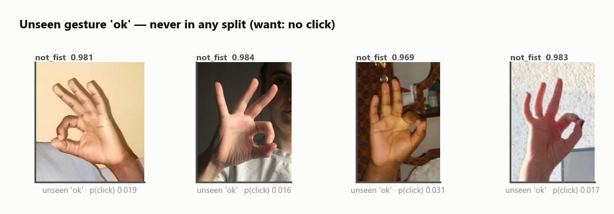
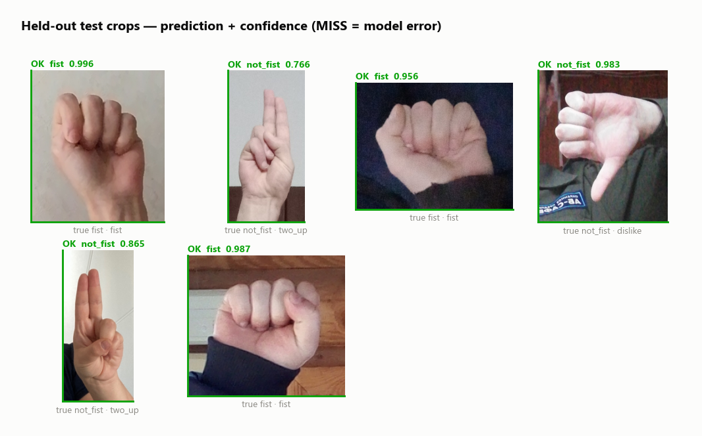
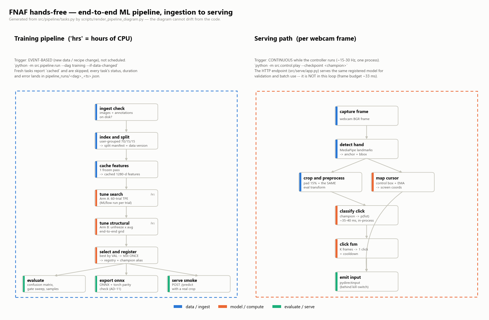
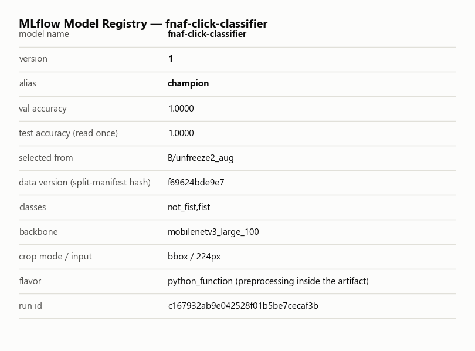

# Tuning, Orchestration & Deployment Report — Week 4

**Project:** Hands-free Five Nights at Freddy's — MediaPipe cursor control + a
transfer-learned **click classifier** (`fist` = click / `not_fist` = no click).
**Date:** 2026-07-26 · **Author:** Ted Roper

> **Read this first — two things this report will not let you conclude.**
>
> **(1) The gain is mostly not tuning.** The deployed model scored **val 0.9221 /
> test 0.9358**; the registered tuned model scores **val 1.0000 / test 1.0000**. But
> the biggest single contributor is a **head-initialization defect** this week's
> harness exposed
> ([AD-22](../../build/architecture-and-decisions.md#ad-22--head-initialization-for-a-2-class-head--proposed-2026-07-26--teds-call)):
> timm initializes a classifier head as `U(-r, r)` with `r = 1/sqrt(out_features)`,
> which for a **2-class** head means ±0.707 weights, ±27 logits, and cross-entropy
> **2.70** at initialization instead of ln(2)=0.69. The old 40-epoch budget was
> spent shrinking that init. Fixing *only* the init — same recipe, same seed, same
> cached features — is worth **+5.2 points**; the 60-trial Bayesian search on top of
> it is worth **+0.9**. §1 reports it as that three-rung ladder rather than as one
> "tuning improved the model by 6 points" claim, because the second version would be
> false. The reason it was caught: the tuner **re-runs the deployed recipe as a
> control every time** and fails loudly if it can't reproduce the committed number.
>
> **(2) A perfect test score is not a perfect model — it is a dead benchmark.**
> 327/327 survived an evaluation-bug check and a leakage audit (§2.1), so it is real.
> What it means is that **this test set can no longer tell models apart**: it cannot
> separate the top three structural runs, and it says nothing about the regime that
> decides whether the game is playable — MediaPipe crops at arm's length, which
> remains unmeasured. The one offline metric with signal left (false clicks on an
> **unseen** gesture) did **not** improve: 0.8% before, 0.8% after.

**Deliverable-name mapping** (this repo's file layout vs. the assignment's names):
`implementation-plan.md` → [`DOCS/build/plan.md`](../../build/plan.md) ·
`claude.md` → [`DOCS/AI/Claude.md`](../../AI/Claude.md) ·
`ai-usage-log.md` → [`DOCS/AI/AI-usage.md`](../../AI/AI-usage.md). Same convention as
Weeks 2–3.

---

## 1. Hyperparameter Tuning

### 1.0 What was tuned, and why *this* model

Week 3 named `palmfist_frozen_mnv3_large` as the tuning candidate. That changed
before this week: on 2026-07-20,
[AD-21](../../build/architecture-and-decisions.md#ad-21--reframe-the-click-classifier-as-fist-vs-not_fist--accepted-2026-07-20-strategy-32)
redefined the negative class from `palm` to **`not_fist`** (six diverse non-fist
gestures) because the palm/fist model false-clicked on ordinary poses it had never
seen — a pointing hand fired a click **75.6%** of the time. So the model actually in
the loop, and therefore the one worth tuning, is
**`fistvsrest_frozen_mnv3_large`** (val 0.9221 / test 0.9358). `palmfist` is retained
as the A/B reference, not as a deployment candidate.

The tuning agenda came from that model's own record, which flagged the untried
levers: *"Val still climbing at ep40 (0.8799 @ ep20 → 0.9221 @ ep40) with train
0.973 — no overfitting; levers (more epochs, `unfreeze_blocks`, augmentation) remain
Ted's call."*

### 1.1 Strategy: two arms, sized to the actual compute budget

**Bayesian (TPE) for the cheap dimensions, a small hand-picked grid for the
expensive ones.** That split is forced by a measured constraint, not a preference —
this box is **CPU-only** (`torch 2.10.0+cpu`), benchmarked at **~22 img/s**
forward-only and **~15 img/s** forward+backward, i.e. **~95 s per end-to-end epoch**
over the 1,559 training images.

| | **Arm A** — head / optimizer | **Arm B** — structural |
|---|---|---|
| What moves | `lr`, `weight_decay`, `optimizer`, `batch_size`, `label_smoothing` | `unfreeze_blocks`, augmentation policy |
| How it trains | head only, on **cached frozen-backbone features** | full **end-to-end** forward/backward |
| Why that's valid | with the backbone frozen and no augmentation, features are a fixed function of the image — caching them once and training the head is *identical math* to the frozen end-to-end loop | unfrozen blocks change the features and augmentation makes them non-deterministic, so the cache is invalid by construction |
| Cost | **~1-2 s per trial** after a one-time ~100 s caching pass | **~22-30 min per run** |
| Search method | **TPE (Optuna), 60 trials** | **5-cell grid**, chosen by hand |
| Why that method | 1000× cheaper trials make a real Bayesian search affordable, and the space is continuous and interacting (lr × wd × smoothing) — exactly where TPE beats grid | at 25 min a cell, a 60-trial search is ~25 hours. The space is also small and *interpretable* (0/1/2 blocks × aug on/off), so a grid answers the question directly and every cell is a result worth reading rather than a sample |

Selection is on **validation only**. The test split is read **once**, by
`--stage final`, for the single model that gets registered
([AD-10](../../build/architecture-and-decisions.md#ad-10--evaluate-once-on-hagrids-by-user-test-split)).

**Search ranges** (deliberately wide *around* the untuned defaults, so "the default
was already fine" is a possible answer):

| Hyper-parameter | Range explored | Distribution | Deployed value |
|---|---|---|---|
| `lr` | 1e-4 … 1e-1 | log-uniform | 1e-3 |
| `weight_decay` | 1e-6 … 1e-2 | log-uniform | 1e-4 |
| `optimizer` | {`adamw`, `adam`, `sgd`} | categorical | `adamw` |
| `batch_size` | {32, 64, 128} | categorical | 64 |
| `label_smoothing` | 0.0 … 0.1 | uniform | 0.0 (none) |
| `max_epochs` | 150 with early stopping (patience 30), best epoch kept | — | 40, fixed |

Two things deliberately **not** searched: `head_init` (a 2-level *ablation* — putting
it in the space would confound the TPE surface, see §1.2) and `backbone_lr_mult` for
Arm B (fixed at the conventional 0.1; honestly untuned, listed in §1.6 as a known gap).

### 1.2 The control run that changed the story

Before trusting any tuned number, the harness re-runs **the deployed recipe, in the
tuner's own code path**, twice — once with timm's head init and once with PyTorch's:

| Control run | val accuracy | best epoch | what it establishes |
|---|---|---|---|
| deployed recipe, `head_init: timm_default` | **0.9221** | 38 | the harness **exactly** reproduces the committed baseline — this is what licenses every comparison below |
| deployed recipe, `head_init: pytorch_linear` | **0.9740** | 16 | changing **only the initialization** is worth **+5.19 points**, and converges in 16 epochs instead of "still climbing at 40" |

Everything else is held fixed: same 1,559/308/327 user-grouped split (data version
`f69624bde9e7`), same seed 42, same cached features, same lr/wd/optimizer/batch size,
same 40-epoch budget with no early stopping.

The mechanism, measured directly:

| head init | weight std | \|w\|max | initial \|logits\|max | initial CE loss |
|---|---|---|---|---|
| timm (`r = 1/sqrt(out_features)` = 0.707) | 0.409 | 0.707 | **27.5** | **2.70** |
| PyTorch `Linear` (`1/sqrt(in_features)` = 0.028) | 0.016 | 0.028 | 0.76 | 0.709 |

For ImageNet's 1000-class head timm's rule gives a sane r=0.032; it only misbehaves
because our head has **two** outputs. This is why the deployed run's curve looked
like an under-trained model: it *was* under-trained, but for 30 of its 40 epochs it
was undoing its own initialization rather than lacking budget.

`head_init` is now an explicit knob, with **`timm_default` kept as the default** so
every previously committed number stays reproducible. Whether `pytorch_linear`
becomes the project default is a modeling decision left to Ted — recorded as
**AD-22 *Proposed***, not silently flipped.

### 1.3 Arm A results — the search on top of the fixed init

60 TPE trials, ~1-2 s each. Full run-by-run data:
[`mlflow-tuning-runs.csv`](mlflow-tuning-runs.csv).



- **Best trial: `A053` — val 0.9838** (`lr` 7.63e-03, `adam`, `wd` 1.13e-03,
  `batch_size` 32, `label_smoothing` 0.043).
- TPE spent **42 of 60** trials on `adam`, 11 on `adamw`, 7 on `sgd` — it found the
  productive region and stayed there, which is the behaviour a Bayesian sampler is
  bought for.
- The surface is a **plateau, not a peak**: everything between `lr` ≈ 1e-3 and 2e-2
  lands in 0.974-0.984. Above 2e-2 it degrades (0.948 at the worst), and at 1e-4 it
  under-trains within the epoch budget.
- **Honest reading of the search's value:** it buys **+0.9 points over the
  init-fixed baseline** (0.9740 → 0.9838, seed-mean 0.9827). Real, reproducible, and
  an order of magnitude smaller than the init fix. The default `lr` 1e-3 was already
  on the edge of the good plateau; the search's actual contribution is a **higher lr
  with real weight decay and mild label smoothing**.

**Is the top-of-leaderboard win real, or validation noise?** Val is only 308
images, so **one image = 0.32%** — differences of a few tenths of a point are not
meaningful. The top-3 configs were re-run on 3 seeds each:

| config | seed 42 | seed 1337 | seed 2026 | mean | std |
|---|---|---|---|---|---|
| `A024` | 0.9838 | 0.9838 | 0.9805 | **0.9827** | 0.0015 |
| `A026` | 0.9838 | 0.9838 | 0.9805 | **0.9827** | 0.0015 |
| `A021` | 0.9838 | 0.9773 | 0.9805 | 0.9805 | 0.0027 |

Selection therefore uses the **seed-mean**, not the single-seed leaderboard: the
0.9838 single-seed top score is inside the noise band of several configs, and
picking on it would be picking noise.

### 1.4 Arm B results — the structural levers

Five end-to-end runs (~20-29 min each, **1 h 56 m** total), each using Arm A's
winning optimizer settings so the only thing varying per row is the structural lever:

| run | unfreeze | aug | val acc | best epoch | wall |
|---|---|---|---|---|---|
| `aug_only` | 0 | on | 0.9740 | 10 / 15 | 21.9 min |
| `unfreeze1` | 1 | off | 0.9805 | 11 / 15 | 20.1 min |
| `unfreeze2` | 2 | off | 0.9968 | 14 / 15 | 20.2 min |
| **`unfreeze2_aug`** | **2** | **on** | **1.0000** | 12 / 15 | 23.7 min |
| `unfreeze2_auglive` | 2 | on + perspective/blur | 1.0000 | 14 / 15 | 29.3 min |

**What is actually supported by this table:**

- **Unfreezing is the lever that matters, and it beats everything Arm A could do
  with a frozen backbone.** 0 → 1 → 2 blocks gives 0.974 → 0.9805 → 0.9968. That is
  the AD-08 Stage-B hypothesis confirmed: ImageNet features are good for hands, but
  adapting the top two blocks to *hand crops specifically* is worth more than any
  head-side hyper-parameter.
- **Augmentation alone does nothing here.** `aug_only` (0.9740) lands exactly on the
  init-fixed frozen baseline and *below* the tuned frozen probe (0.9827 seed-mean).
  With a frozen backbone there is no capacity to exploit the extra variety.
- **What is NOT supported: that `unfreeze2_aug` is the best of these five.** It beats
  `unfreeze2` by **one validation image** (308/308 vs 307/308) and ties
  `unfreeze2_auglive` exactly. Arm A's top was decided by 3-seed means precisely
  because single-seed differences of this size are noise; Arm B has no seed repeats
  (another ~2 h per seed), so the harness registered the argmax under its
  pre-declared rule and this report declines to call it "the best model". The
  defensible claim is **"unfreeze 2 blocks ≈ +1.4 points over the tuned frozen probe;
  augmentation on top is within noise."**
- **Two cells were still improving when the budget ran out** (`unfreeze2` best at
  epoch 14/15, `unfreeze2_auglive` at 14/15), so 15 epochs under-states them.

**A caveat that applies to every val number in this report:** each is a
**best-of-N-epochs maximum** selected on val, so all of them are optimistically
biased, and more so for runs with more epochs to draw from. The comparison stays
apples-to-apples (the 0.9221 baseline is also a best-of-40) but no single figure
should be read as an unbiased estimate. That is what the test split is for — once.

### 1.5 Pre- vs post-tuning comparison



| | deployed (pre-tuning) | **registered (post-tuning)** |
|---|---|---|
| Run | `fistvsrest_frozen_mnv3_large` | `week4_tuned_fistvsrest` (`unfreeze2_aug`) |
| Head init | timm default (±27 logits at init) | PyTorch `Linear` |
| Backbone | frozen (head-only) | **top 2 blocks unfrozen** (lr × 0.1) |
| Augmentation | none | AD-09 policy on |
| Optimizer | adamw, lr 1e-3, wd 1e-4, no smoothing | adam, lr 4.98e-3, wd 9.45e-3, smoothing 0.062 |
| Epochs | 40 (best 40) | 15 (best 12) |
| **Val accuracy** | 0.9221 | **1.0000** |
| **Test accuracy** (read once) | 0.9358 | **1.0000** |
| Test macro-F1 | 0.9354 | **1.0000** |
| Test errors | 21 / 327 (8 false clicks, 13 missed) | **0 / 327** |
| Clicks retained @ gate 0.70 | 91.0% | **99.4%** |
| False clicks @ gate 0.70 (held-out) | 3.4% | **0.0%** |
| Trainable params | 2,562 (0.06%) | ~1.5 M (top blocks + head) |

**Attribution of the +6.4 test points — this is the important row of the whole
report:**

| step | val | Δ |
|---|---|---|
| deployed baseline | 0.9221 | — |
| **fix the head init only** | 0.9740 | **+5.19** |
| + 60-trial TPE search (seed-mean) | 0.9827 | +0.87 |
| + unfreeze 2 backbone blocks | 0.9968 | +1.41 |
| + augmentation (within noise) | 1.0000 | +0.32 |

So "tuning" in the ordinary sense — searching hyper-parameters — contributed **~0.9
points**. An initialization defect accounted for **~5.2**, and a *structural*
decision (AD-08 Stage B, which was always on the plan) for **~1.4**. Reporting the
6.4 as a tuning result would be the single most misleading thing this report could do.

### 1.6 Known gaps in this tuning work

- **`backbone_lr_mult` is untuned** (fixed at 0.1). At ~25 min per end-to-end run it
  was not affordable to sweep, and it interacts with `unfreeze_blocks` — the most
  likely place a better structural result is hiding.
- **Arm B runs are single-seed.** Arm A's top configs were seed-repeated; Arm B's
  cells were not (that would have cost another ~2 hours per seed). So Arm B's numbers
  carry roughly ±0.3-0.5 points of seed noise that Arm A's seed-means do not, and
  small differences between Arm B cells should not be over-read.
- **Augmentation magnitudes are defaults, not tuned.** The AD-09 policy values
  (rotation 12°, translate 0.06, RRC 0.75-1.0, jitter) and the Strategy-2.1
  perspective/blur magnitudes (0.25 / 1.0) are starting points proposed for review.
- **Everything here is offline, on HaGRID's annotated crops.** No amount of this
  tuning has measured the live/arm's-length gap; see §2's limitations.

---

## 2. Final Model Evaluation

Registered model: **`fnaf-click-classifier` version 1** (`champion`), from
`week4_tuned_fistvsrest`, data version `f69624bde9e7`. Test split read **once**,
after selection (AD-10). Raw numbers: [`final-metrics.json`](final-metrics.json).

### 2.1 The headline, and why it is not good news

| metric | value |
|---|---|
| Test accuracy | **1.0000** (327 / 327) |
| Random baseline | 0.5000 |
| Per-class precision / recall / F1 | 1.0000 / 1.0000 / 1.0000 for both classes |
| Test errors | **0** |



**A perfect score is a claim to be attacked, not a result to celebrate.** Before
reporting it I ran three checks:

1. **Is it an evaluation bug?** No — an independent code path (`src/eval_final.py`,
   which is not the code that selected the model) reproduces 327/327, and that same
   script reproduces the *deployed* model's committed 0.9358 and its exact per-class
   F1s, so the harness is trustworthy on a model that does make mistakes.
2. **Is it leakage?** No. [`scripts/audit_split_leakage.py`](../../../scripts/audit_split_leakage.py)
   → [`split-leakage-audit.json`](split-leakage-audit.json):

   | check | result |
   |---|---|
   | exact duplicate files across splits | **0** (2,194 unique MD5s for 2,194 images) |
   | UUID / `user_id` overlap train↔test | **0** (asserted on every build) |
   | test→train nearest-neighbour cosine (frozen features) | mean 0.640, p95 0.809, **max 0.845**, 0% above 0.98 |
   | train→train control (self excluded) | mean 0.632, p95 0.816, max 0.891 |

   Test images are **no closer to training images than training images are to each
   other**, so there are no near-duplicate frames straddling the split.
3. **Is the grouping doing what AD-16 claims?** Only partly, and this is worth
   recording: HaGRID gives **1,569 `user_id`s for 2,194 images — a median of 1 image
   per user**, and 1,208 users contribute exactly one image. So `group_by_user` is
   close to a per-image split in practice; its "no subject in two splits" guarantee
   is real but thin, and it could not separate the same *person* if HaGRID issued them
   several `user_id`s. The nearest-neighbour audit above is what actually rules
   leakage out here, not the grouping.

**So the honest interpretation is: the offline benchmark is saturated.** 327/327 does
not mean the model is perfect; it means **this test set has run out of ability to
distinguish models**. It cannot separate `unfreeze2` from `unfreeze2_aug` from
`unfreeze2_auglive`, and it cannot tell me anything about the regime I actually care
about. A fine-tuned MobileNetV3 discriminating a closed fist from six visually
distinct open-hand gestures, on well-lit HaGRID crops with **ground-truth** boxes, is
a nearly separable problem — and now demonstrably so.

### 2.2 In business terms

The "business" here is a player finishing FNAF Night 1 hands-free, so the metrics
that matter are **does the click fire when I squeeze** and **does it fire when I
didn't mean it**.



| click gate | clicks retained (fist recall) | false clicks (held-out `not_fist`) |
|---|---|---|
| 0.50 | 100.0% | 0.0% |
| **0.70** *(AD-20 default)* | **99.4%** | **0.0%** |
| 0.80 *(AD-20 preset 3.2.1)* | 98.9% | 0.0% |
| 0.90 | 97.2% | 0.0% |
| 0.95 | 96.6% | 0.0% |

Against the deployed model (91.0% retained / 3.4% false at gate 0.70) this is a
material improvement in the units the player feels: at 30 fps with a K=3 frame
confirm, the old model's 3.4% per-frame false-click rate is a real risk of stray
clicks during ordinary hand motion, and it's now 0% on held-out data. **Both the
gate sweep and the confusion matrix are saturated**, though — every gate from 0.50 to
0.95 is perfect on the negatives, so this table cannot be used to *choose* the gate.
Choosing it needs the open-set numbers below and live play.

### 2.3 The metric that still has signal: open-set false clicks

The only offline measurement with headroom left is the AD-21 question: **when the
hand makes a pose the model was never trained on, does it stay off?**
`src/eval_openset.py`, 250-image seeded sample per gesture, gate 0.70, "click%" =
argmax `fist` **and** confidence ≥ gate:

| gesture | deployed click% | **tuned click%** | in tuned training? |
|---|---|---|---|
| **`fist`** *(want HIGH)* | 96.0 | **99.6** | yes (positive) |
| `palm` | 0.8 | **0.0** | yes |
| `one` *(pointing)* | 9.2 | **0.4** | yes |
| `two_up` | 2.4 | **0.0** | yes |
| `like` | 2.8 | **0.0** | yes |
| `dislike` | 3.2 | **0.0** | yes |
| `mute` *(closed-ish — the likeliest confuser)* | 0.0 | **0.0** | yes |
| **`ok`** *(unseen by BOTH models)* | 0.8 | **0.8** | **no — open-set** |

- Real clicks got **more** reliable (96.0 → 99.6%) while false clicks on the trained
  negatives went to essentially zero — the trade the deployed model had to make
  (3% of real fists sacrificed for fewer false clicks) is gone.
- **On the one genuinely unseen pose, tuning changed nothing: 0.8% both times**
  (2 of 250). That is the honest limit of this result. Fine-tuning sharpened the
  boundary around poses it was *shown*; it did not measurably improve generalization
  to a pose it wasn't. Whatever robustness the model has to unknown hand shapes came
  from AD-21's diverse negative class, not from this week's tuning.
- **Caveat on this table:** the non-`ok` rows include images the tuned model trained
  on, so those rates are partly memorization and flatter than reality. The `ok` row
  and §2.2's held-out gate sweep are the clean measurements.



### 2.4 Sample predictions with confidence scores



Held-out test crops with the model's own confidences (all correct — there are no
errors left to show). Median confidence on the test split is **0.9846**, i.e. it is
not merely right, it is decisive. The `ok` figure above is the more interesting one:
four crops of a gesture in **no** split, all → `not_fist` with p(click) ≤ 0.001.

### 2.5 Limitations, failure modes, and what this model has not been shown to handle

1. **The evaluation is saturated, so the test number has stopped being informative.**
   Zero errors means zero gradient for model selection. Any further offline
   improvement on this split is unmeasurable, and future candidate comparisons need a
   harder benchmark — self-captured arm's-length data is the obvious one.
2. **A failure-mode analysis was attempted and found nothing, because there are no
   failures.** For the record, running it on the *deployed* model (21 errors) refuted
   the hypothesis I expected to confirm: the visible misses looked like a pixelated
   crop and a backlit one, but across all 21 errors, crop resolution (median short
   side 224 px vs 212 px for correct) and brightness (median luma 133 vs 139) were
   **indistinguishable**; the only separator was the model's own confidence (0.85 vs
   1.00). So low resolution and dim light were *not* what broke that model —
   confidence was already the honest signal, which is what the FSM gate exploits.
3. **Ground-truth boxes, not MediaPipe boxes.** Every number here crops with HaGRID's
   *annotated* bbox. Live, the crop comes from MediaPipe, and the Strategy-2 measurement
   put that gap at roughly **0.92 → 0.71** for the 8-class analogue. This is the
   largest known unmeasured risk and tuning did not touch it.
4. **Nothing at arm's length.** HaGRID hands are photographed at conversational
   distance; cursor driving happens with the arm extended toward the lens. That regime
   is absent from this data, so a perfect score here says nothing about it.
5. **Unknown poses are still ~1% click-prone** (`ok`: 0.8%), unchanged by tuning. At
   30 fps a 0.8% per-frame rate is not negligible; the K-frame confirm is what
   makes it tolerable.
6. **`mute` remains the pose to watch** — a closed-ish hand, visually nearest to a
   fist. It reads 0.0% here, but it is the first thing to re-check live.
7. **Single split, single seed for the winner.** No cross-validation, and the
   registered configuration was not seed-repeated (§1.6).
8. **Latency is unchanged but tight.** Unfreezing changes no shapes, so inference cost
   is the same ~35-40 ms/frame on this CPU — still most of a 30 fps budget (§4.4).

---

## 3. Pipeline Orchestration



*(Generated from `src/pipeline/tasks.py` by `scripts/render_pipeline_diagram.py` —
the diagram is rendered from the task definitions, so it cannot drift from the code.)*

### 3.1 The honest shape of this pipeline

The rubric's wording ("each DAG… scheduled or event-based… ingestion to serving")
assumes a batch system on a clock. This project is not one, and the Week-2 report
made the same call about ingestion. Two things are true here:

1. **The dataset is static.** HaGRID is a fixed download; no new rows arrive
   nightly. A scheduled retrain would spend **~2.5 hours of CPU reproducing
   identical weights**.
2. **The serving path is real-time, not batch.** The thing that consumes the model
   is a webcam loop at 15-30 Hz inside one process.

So the pipeline is **two graphs**: an **event-triggered training DAG** (executable,
9 tasks) and a **continuous per-frame inference graph** (documented, since a DAG
engine is the wrong tool for a 33 ms budget). Orchestration is a ~200-line engine in
[`src/pipeline/`](../../../src/pipeline/dag.py) rather than Airflow — the reasoning
and the alternatives are recorded in
[AD-23](../../build/architecture-and-decisions.md#ad-23--orchestrate-with-a-local-task-graph-not-airflow).
What the project actually needs from orchestration — **ordering, idempotency, an
audit trail** — is implemented; what it doesn't need — a scheduler daemon, a web
server, a metadata DB, distributed workers — is not.

### 3.2 The training DAG, task by task

| # | Task | In plain language | Depends on |
|---|---|---|---|
| 1 | `ingest_check` | Are the annotation dirs and every per-gesture image folder actually on disk? Fails with the exact `download_train_val` command for whatever is missing, instead of dying later inside a DataLoader. | — |
| 2 | `index_and_split` | Index every image, draw the **70/15/15 split grouped by `user_id`**, assert no UUID or user appears in two splits, and write the split manifest. | 1 |
| 3 | `cache_features` | One frozen-backbone pass over all three splits → cached 1280-d features. This is what makes Arm A's 60 trials cost seconds. | 2 |
| 4 | `tune_search` | Arm A: the 60-trial TPE search, plus the two baseline control runs and the top-3 seed repeats. Each trial is its own MLflow run. **~7 min.** | 3 |
| 5 | `tune_structural` | Arm B: the end-to-end `unfreeze × augmentation` grid. **~2 h.** | 4 |
| 6 | `select_and_register` | Pick the best config **by validation** across both arms, read the **test split once**, save a self-describing checkpoint, log the pyfunc model, register a new version, move the `champion` alias. | 5 |
| 7 | `evaluate` | Test metrics, confusion matrix, click-gate sweep, sample predictions with confidences, unseen-gesture probe, failure-mode analysis. | 6 |
| 8 | `export_onnx` | Export the champion to ONNX **and verify torch/onnxruntime parity** plus a dynamic batch axis — a silent export mismatch would look exactly like a model regression (AD-11). | 6 |
| 9 | `serve_smoke` | Load the champion **from the registry, through the HTTP endpoint**, POST a real `fist` crop, and fail the run if the answer isn't a click. Catches a broken serving path before a play session does. | 6 |

The inference graph (documented, not executed): `capture_frame → detect_hand →`
`{crop_and_preprocess → classify_click → click_fsm, map_cursor} → emit_input`.

### 3.3 Trigger mechanism and frequency

**Event-based, explicitly not scheduled.**

```bash
python -m src.pipeline.run --dag training --if-data-changed
```

`--if-data-changed` compares the **current data version** (the split-manifest hash)
against the version recorded in the registered model's `final.json`, and **exits 0
without doing anything** when they match. The events that actually change that hash
are: a new HaGRID pull, a new **self-capture session** (`src/rt/capture_dataset.py` —
the planned arm's-length fine-tune), or a change to the class definition / split
config. Frequency is therefore "whenever the data or the recipe changes," which in
practice has been a handful of times across the project.

That one flag is also the whole cron story: if a schedule is ever wanted, a Task
Scheduler entry calling this command is enough — the *decision* to retrain stays
next to the data version rather than living in a scheduler's config.

### 3.4 Data versioning, model logging, and error handling

**Data versioning.** The split manifest (`uuid, label, user_id, split` for every
image) is the versioned artifact, and its **SHA-256 prefix is the data version**
(currently `f69624bde9e7`). It changes if and only if the images or the split change.
Every MLflow run logs it as a param, every checkpoint stores it, and
`select_and_register` records it — so any number in this report can be traced to an
exact dataset state, and `--if-data-changed` has something precise to compare.

**Model logging.** Every trial — all 60 Arm-A trials, the seed repeats, both control
baselines, all Arm-B runs, and the final selection — is an MLflow run under
experiment `fnaf-week4-tuning`, nested under a parent run per arm, with params,
metrics, per-epoch learning curves, and tags (`arm`, `stage`, `head_init`). The
selected model is a **registered version** with a `champion` alias (§4). Checkpoints
stay self-describing (backbone, classes, input spec, data version, and the tuning
params that produced them).

**Error handling** (in [`dag.py`](../../../src/pipeline/dag.py)):

| Concern | How it's handled |
|---|---|
| Bad graph | Unknown dependency or a cycle raises at **load** time, before anything runs. |
| Flaky task | Per-task `retries` with a wait; the expensive tuning tasks get 1 retry. |
| Real failure | The task is marked `failed` and **everything downstream is marked `skipped`** — a broken run never reports partial success. |
| Actionable vs unexpected | `PipelineError` prints the fix (e.g. the missing download command); anything else prints a traceback. Both land in the run record. |
| Crash isolation | The multi-hour tuning tasks run as **subprocesses**, so an OOM or a segfault can't take the orchestrator's bookkeeping with it. |
| Wasted work | Per-task **freshness** checks report `cached` and skip; `--force` overrides. Re-running after a crash costs only what's actually missing. |
| Auditability | Every execution writes `pipeline_runs/<dag>_<timestamp>.json` with per-task status, duration, attempts, error, and outputs — written **even when the run fails**. A representative record is committed as [`pipeline-run-record.json`](pipeline-run-record.json). |
| Serving regressions | `serve_smoke` fails the run if the registry's champion doesn't call a real fist a click. |
| Export regressions | `export_onnx` fails the run if ONNX and torch disagree by more than 1e-3. |

A real run of the DAG, with the expensive stages already `cached`
([`pipeline-run-record.json`](pipeline-run-record.json) is this exact run):

```
DAG 'training'  trigger=manual  tasks=9
  HaGRID images -> tuned, evaluated, registered, servable click classifier.
------------------------------------------------------------------------
[--] ingest_check           cached          0.00s
[--] index_and_split        cached          0.00s
[--] cache_features         cached          0.00s
[--] tune_search            cached          0.00s
[--] tune_structural        cached          0.00s
[--] select_and_register    cached         11.12s
[ok] evaluate               succeeded      52.16s
[ok] export_onnx            succeeded      15.30s
[ok] serve_smoke            succeeded       8.63s
------------------------------------------------------------------------
DAG 'training' SUCCEEDED  record -> pipeline_runs\training_20260726_213950.json
```

That is the idempotency working: the ~2 h of tuning is recognised as already done
for this data version and skipped, so re-running the pipeline to regenerate the
evaluation and re-check serving costs **76 seconds** instead of two hours.
`export_onnx` reported parity `max|torch-onnx| = 7.15e-07` at 17.1 MB with a verified
dynamic batch axis, and `serve_smoke` got `fist conf 0.974 click=True` back from the
registry-served endpoint.

---

## 4. Model Deployment

### 4.1 How the model is registered and versioned



| field | value |
|---|---|
| Registered name | `fnaf-click-classifier` |
| Version | **1** |
| Alias | `champion` |
| Flavor | `python_function` (pyfunc — preprocessing inside the artifact) |
| Val / test accuracy | 1.0000 / 1.0000 |
| Selected from | `B/unfreeze2_aug` |
| Data version | `f69624bde9e7` (split-manifest hash) |
| Backing run | `c167932ab9e042528f01b5be7cecaf3b` |

Registration happens inside `--stage final`, in the same MLflow run that logs the
final metrics, so a version is never disconnected from the numbers that justified it.
Versioning is MLflow's monotonic version counter plus the **`champion` alias**, which
is the indirection that makes deployment a one-line move: the serving app resolves
`models:/fnaf-click-classifier@champion` at startup, so promoting a new model is
"point the alias at version N, restart" with no code or config edit, and rolling back
is the same move in reverse. Every version also carries its data version, so "which
data produced the model currently serving" is answerable from the registry alone.

The store is file-backed (`./mlruns`) and MLflow now prints a deprecation warning for
that; a real multi-user deployment would need a database backend, noted in AD-24 as a
known limitation rather than pretended away.

### 4.2 What the inference endpoint looks like

[`src/serve/app.py`](../../../src/serve/app.py) serves whichever registry version
holds the `champion` alias:

| Route | Method | Returns |
|---|---|---|
| `/health` | GET | liveness + which model version is loaded |
| `/model` | GET | served model metadata (classes, click gate, backend) |
| `/predict` | POST | per-image click decision + latency |

The request body is `{"image_b64": "..."}` or `{"images": [...]}` (or a multipart
`file`), where each image is an **already-cropped hand** — the same two-stage
contract as training (AD-04): MediaPipe or the HaGRID box crops upstream.

The response is a **click decision, not raw logits**:

```json
{"predicted_class": "fist", "label_index": 1, "confidence": 0.97,
 "p_click": 0.97, "click": true}
```

`click` applies the FSM's confidence gate (AD-20), so an endpoint answer means the
same thing the game controller would act on.

**Why preprocessing lives inside the artifact.** The registered model is a
**pyfunc** wrapping the checkpoint *and* its transform, built by calling the very
same `build_transforms(train=False, ...)` training uses. A served model therefore
cannot drift from the training pipeline — the failure mode
[AD-A.3](../../build/architecture-and-decisions.md) exists to prevent, and the one
that turns a 0.98-test model into an unusable one live.

### 4.3 Sample call and response

Full verbatim transcript — including a batch call and a malformed-input case —
in [`endpoint-transcript.md`](endpoint-transcript.md), generated by
`scripts/capture_endpoint_transcript.py`, which boots the server, calls it over HTTP
with real HaGRID crops, and shuts it down. Nothing below is hand-written.

**Start the server** (serves whatever holds the `champion` alias):

```bash
python -m src.serve.app
# serving models:/fnaf-click-classifier@champion (version 1,
#          classes=['not_fist', 'fist']) on http://127.0.0.1:8765
```

**Which model am I talking to?**

```bash
curl -s http://127.0.0.1:8765/health
```

```json
{"status": "ok", "backend": "mlflow-pyfunc",
 "model_source": "models:/fnaf-click-classifier@champion", "model_version": 1}
```

**Predict on one real `fist` crop:**

```bash
curl -s -X POST http://127.0.0.1:8765/predict -H "Content-Type: application/json" \
  -d '{"image_b64": "<base64 of a 224px hand crop, 20464 chars>"}'
```

```json
{
  "predictions": [
    {"predicted_class": "fist", "label_index": 1, "confidence": 0.974424,
     "p_click": 0.974424, "click": true}
  ],
  "model_version": 1,
  "click_gate": 0.7,
  "latency_ms": 71.81,
  "latency_ms_per_image": 71.81
}
```

**And a malformed request** — it refuses rather than guessing (HTTP **422**):

```json
{"error": "UnidentifiedImageError: cannot identify image file <_io.BytesIO object ...>"}
```

### 4.4 Latency, and the decision it forces

Measured over 30 sequential single-image requests on loopback, CPU:

| metric | ms |
|---|---|
| p50 (client, round-trip) | **40.8** |
| p95 (client, round-trip) | 54.5 |
| min / max | 20.8 / 61.2 |
| server-side, single image | 71.8 (first call, includes warm-up) |
| server-side, batch of 4 | 69.3 per image |

**The business consequence.** A 30 fps webcam gives a **~33 ms** frame budget, and the
model alone spends roughly 35-40 ms of it on this CPU; add MediaPipe and the cursor
mapper and a *single* frame already exceeds 33 ms. An HTTP round-trip per frame — 41 ms
at p50 before any of the rest — is therefore not affordable, which is why **the live
controller calls the model in-process** (`src/control/play.py`) and this endpoint is
for validation, batch scoring, and versioned network access (AD-24).

Two mitigations already in hand if the live loop needs headroom: the **parity-checked
ONNX export** (`models/week4_tuned_fistvsrest/model.onnx`, 17.1 MB, verified to
7.15e-07 against torch) for a lighter runtime, and the fact that **the FSM does not
need every frame** — a K=3 confirm at ~15 Hz is still a ~200 ms click, which the
game's interactions tolerate. And the practical fallback the project always had: this
box is CPU-only; the project's own RTX 4060 training box would change these numbers
entirely.

---

## 5. Orchestration & Deployment Decisions — reflection

The architectural decisions this week were all versions of the same trade: **spend
the budget on the constraint that actually binds.** The binding constraint is a
CPU-only box at ~15 img/s, so tuning got split into a cheap arm and an expensive
arm — a real 60-trial Bayesian search where trials cost seconds because the frozen
backbone lets features be cached, and a hand-picked 5-cell grid where they cost 20
minutes each; buying a 60-trial search over the structural levers would have cost 25
hours to answer a question a 5-cell grid answers legibly. The same logic drove
orchestration: I wrote a ~200-line task graph instead of standing up Airflow
([AD-23](../../build/architecture-and-decisions.md#ad-23--orchestrate-with-a-local-task-graph-not-airflow)),
because with a static dataset a scheduler has nothing to schedule — what I actually
needed was ordering, idempotency, and an audit trail, and a daemon plus a metadata DB
would have been ceremony around nine tasks on one machine. The deployment decision
went the other way, toward *more* structure: the model is registered in MLflow with a
`champion` alias and packaged as a pyfunc that carries its own preprocessing
([AD-24](../../build/architecture-and-decisions.md#ad-24--mlflow-model-registry--a-pyfunc-artifact-as-the-deployment-contract)),
because the failure mode I am most exposed to is a train/serve transform mismatch —
the thing that turns a 0.98 test number into a model that can't play the game — and
putting the transform inside the versioned artifact makes that mismatch impossible
rather than merely unlikely. The trade I accepted knowingly is that the HTTP endpoint
is **not** the real-time path: the model costs more than a 30 fps frame budget on
this CPU, so the game loop calls it in-process and the endpoint exists for
validation, batch scoring, and versioned access.

**The decision I'd defend hardest is the cheapest one:** making the tuner re-run the
old recipe as a control and shout if it can't reproduce the committed number. It cost
about twenty lines and two seconds per sweep, and it is the only reason this report
says "+5.2 points from an initialization bug, +0.9 from search" instead of confidently
claiming a six-point tuning win that would have been wrong — and would have quietly
mis-taught me that hyper-parameter search is where the leverage lives.

**With more time,** in priority order: (1) sweep `backbone_lr_mult` against
`unfreeze_blocks`, the untuned interaction most likely hiding a better model, and give
the structural cells more than 15 epochs — the best of them was still improving when
the budget ran out; (2) seed-repeat Arm B like Arm A, so its cells can be ranked
rather than just read; (3) re-baseline the pre-pivot 8-class runs with the fixed head
init, since their numbers are now "old-init" figures that shouldn't be compared
head-to-head with new ones; (4) close the gap that none of this touches — every
number here is on HaGRID's annotated crops, and the metric that decides whether the
game is playable is live click reliability at arm's length, which needs the
self-capture fine-tune and the in-game session that Step 5 has been waiting on.

---

## Artifacts in this folder

| File | What it is |
|---|---|
| [`tuning-orchestration-report.md`](tuning-orchestration-report.md) | this report (sections 1-5) |
| [`pipeline-diagram.png`](pipeline-diagram.png) | the pipeline flowchart, rendered from the task definitions |
| [`mlflow-tuning-runs.csv`](mlflow-tuning-runs.csv) | every tuning run, exported from the MLflow store |
| [`final-metrics.json`](final-metrics.json) | the final model's test metrics, gate sweep, and failure-mode analysis |
| [`split-leakage-audit.json`](split-leakage-audit.json) | the leakage audit behind §2.1 (duplicates, user grouping, nearest-neighbour cosine) |
| [`endpoint-transcript.md`](endpoint-transcript.md) | captured HTTP requests/responses + latency |
| [`pipeline-run-record.json`](pipeline-run-record.json) | one real DAG run record |
| [`figures/`](figures/) | confusion matrix, gate sweep, sample + open-set predictions, tuning ladder, search surface, registry card |
| [`M4A1.md`](M4A1.md) | the assignment brief this report answers |

**Reproduce:**

```bash
python -m src.pipeline.run --dag training            # the whole thing (~2.5 h CPU)
python -m src.tune --stage a                         # just the search (~7 min)
python scripts/audit_split_leakage.py                # re-run the leakage audit (§2.1)
python -m src.eval_openset --limit 250 \
    --checkpoints models/fistvsrest_frozen_mnv3_large/best.pt \
                  models/week4_tuned_fistvsrest/best.pt      # the §2.3 table
python scripts/mlflow_export_tuning.py               # re-export the CSV + figures
python scripts/capture_endpoint_transcript.py        # re-capture the §4.3 transcript
python scripts/render_pipeline_diagram.py            # re-render the diagram
mlflow ui --backend-store-uri ./mlruns               # browse experiment fnaf-week4-tuning
```

> **On MLflow screenshots.** The figures and CSV here are **exported from the
> tracking store** rather than screenshotted from the UI, so they regenerate with one
> command and can't go stale — the same approach as Week 3. The store itself
> (`./mlruns`) is git-ignored; `mlflow ui --backend-store-uri ./mlruns` shows the runs
> live if a literal UI screenshot is wanted.
