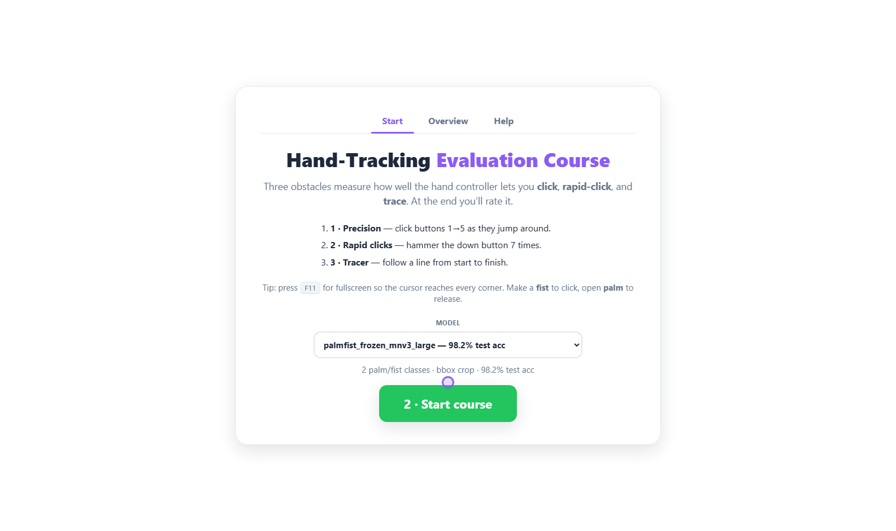
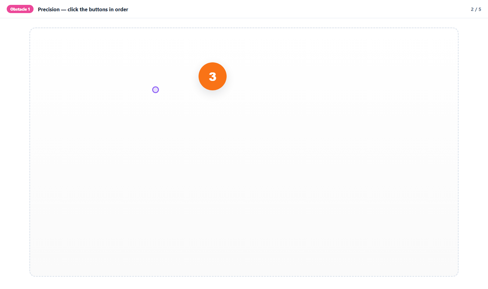
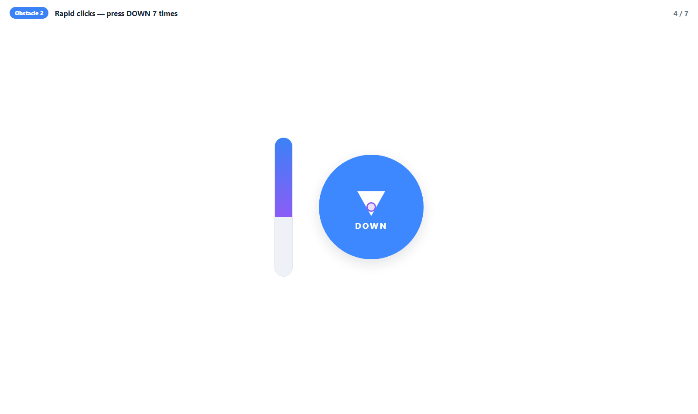
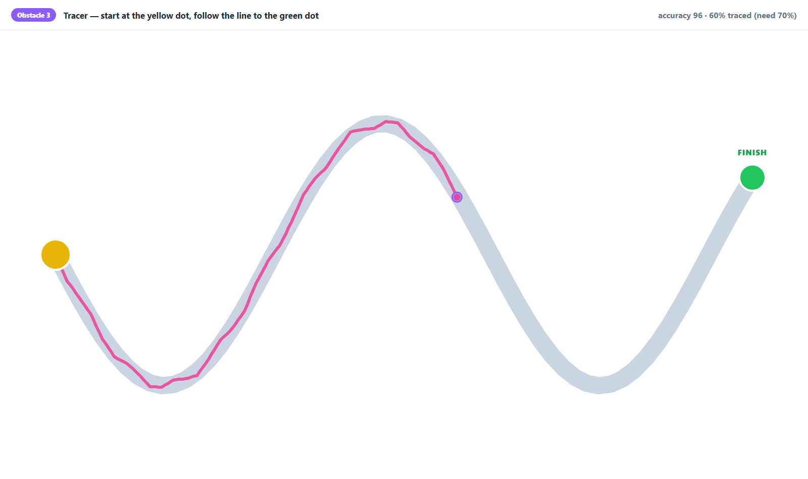
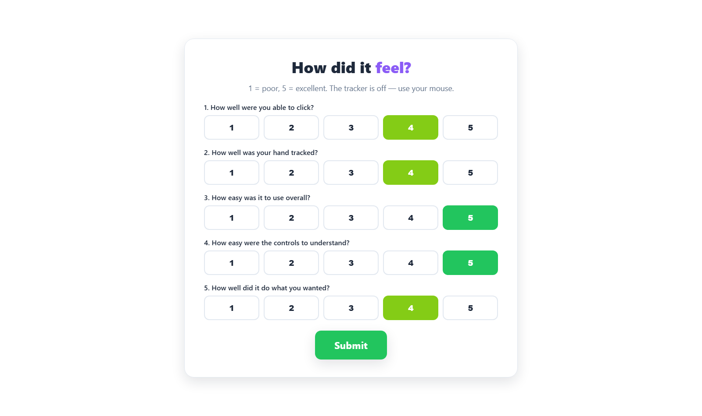
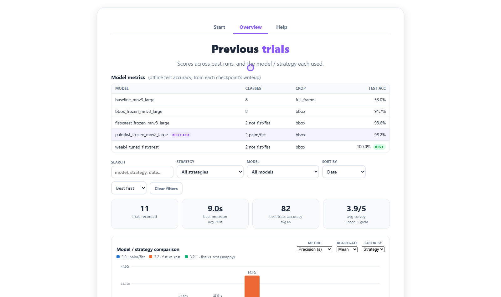

# How to use it

**A plain-language guide to the Hand-Tracking Evaluation Course.**
No technical background needed. If you have never seen this before, start here
and read straight down.

---

## What this thing is

A webcam watches your hand and turns it into a mouse.

- **Move your hand** → the mouse pointer moves with it.
- **Close your hand into a fist** → that's a click.
- **Open your hand flat** → that's letting go.

That's the whole controller. It was built so the video game *Five Nights at
Freddy's* can be played without touching a keyboard or mouse — the game is
entirely mouse-driven, so a hand that can point and click is enough to play it.

**This app is the test track for that controller.** It gives you three small
challenges, times how you do, and then asks you to rate it. It is how we find out
whether the controller is genuinely usable by someone other than the person who
built it.

## Who it's for

- **Anyone testing the controller.** You don't need to know anything about how it
  works, and you can't break it.
- **Anyone deciding whether it's good enough** — the results page turns "it felt
  laggy" into numbers you can compare between versions.

---

## Before you start

- You need a **webcam** and reasonable light on your hand. Facing a window works;
  a bright light directly behind you does not.
- Sit about **an arm's length** from the camera and keep your hand in frame.
- Press **F11** for fullscreen. Without it, part of the screen is off-limits and
  some buttons are unreachable.

> **The brake, first:** pressing **ESC** at any time instantly stops the
> controller and gives you your normal mouse back. It works even if you've
> clicked away from this window. If anything feels out of control, press ESC.

---

## Step by step

### 1. Open the page
Someone will have started it for you; if not, the technical setup is in the
[README](../../../README.md). You'll land on the **Start** tab.

### 2. (Optional) Pick a model
The **Model** dropdown chooses which trained version of the hand-reader to test.
Each option shows how accurate it was in offline testing (e.g. `98.2% test acc`).
**If you don't have a reason to change it, leave it alone** — the default is fine.

If a **Click strategy** box appears, it's choosing how eager the click should be:
*steady* waits a fraction longer to be sure, *snappy* fires sooner. Again, the
default is fine.

Both of these lock once you start, so pick before step 3.

### 3. Click "1 · Start hand tracker" — with your normal mouse
This turns the camera on and takes a few seconds. Use your real mouse for this
one click; you can't turn the hand controller on with the hand controller.

A small chip appears in the **top-left corner**. When it turns **green**, the
camera can see your hand and you're good to go. Amber means it can't see your
hand — move it into frame. Red means something went wrong; the chip will say
what.

### 4. Click "2 · Start course"
This button stays greyed out until the camera is actually running, so if it's
grey, go back to step 3.

### 5. Do the three challenges

**Challenge 1 — Precision.** Five numbered buttons appear one at a time in
different places. Point at each one and squeeze a fist to click it. They jump
around on purpose: this measures whether you can put the pointer where you mean
to.

**Challenge 2 — Rapid clicks.** One big button, seven clicks. You have to
**open your hand between clicks** — a held fist is one click, not many. The bar
fills up as you go.

**Challenge 3 — Tracer.** Click the yellow **START** dot, then follow the curved
line to the green **FINISH** dot. A pink trail shows where your hand actually
went. The text at the top-right tells you how much of the line you've covered and
how much you still need — you can't finish early by jumping to the end dot.

### 6. Finish and rate it
You'll see your three scores, then **Finish & Rate**. Pressing it **turns the
camera controller off**, so you answer the five questions with your normal mouse.
Answer honestly — a bad score here is more useful than a polite one.

### 7. Done
The page confirms your run was saved and names the file. That's it — you're
finished. Your run now appears on the **Overview** tab alongside every previous
one.

---

## What the numbers mean

At the end you get three scores, and they show up in the results table as
**Precision**, **Rapid**, and **Trace**.

| Score | What it is | Which way is good | Rough reading |
|---|---|---|---|
| **Precision** | Seconds to click all five numbered buttons | **Lower is better** | Under ~15 s is a good run. Across the 11 recorded trials: 9.0 s best, 73.8 s worst, 27.0 s average |
| **Rapid** | Seconds to click one button seven times | **Lower is better** | 2.7 s best, 21.6 s worst, 8.4 s average |
| **Trace** | 0–100 score for how closely you followed the line | **Higher is better** | 82 best, 49 worst, 65 average |
| **Survey** | Your own 1–5 average | **Higher is better** | 4.4 best, 3.4 worst, 3.9 average |

**How to interpret them as a business user:**

- **Precision is the "can I aim" number.** If it's high, the pointer is fighting
  you — usually jitter, over-smoothing, or clicks landing late.
- **Rapid is the "can I click repeatedly" number.** If it's high while precision
  is fine, aiming works and *clicking* is the problem — squeezes not registering,
  or the controller not noticing your hand reopened.
- **Trace is the "is the pointer smooth" number.** A low score with good
  precision means the pointer gets there eventually but not in a straight line.
- **The survey is not decoration.** It's the only number that captures "it
  worked, but it was exhausting" — which is a real failure mode for something you'd
  hold your arm up for.

**Compare like with like.** Every trial is stamped with the model and strategy it
used, and the Overview tab can filter and chart by those. A single run tells you
little; the same model across a few runs, versus another model across a few runs,
tells you something.

### The one comparison to be careful with

The Overview tab shows a **Model metrics** table of offline accuracy scores —
including one model at **100%**. That does **not** mean it is the best
controller, and the app says so on its Help tab.

Those percentages come from testing on a photo dataset, on neatly cropped
pictures of hands. Using it live — your webcam, your lighting, your arm at full
stretch — is a harder problem that the percentage never measured. **The obstacle
course exists precisely because those two things can disagree.** Trust the trial
numbers over the accuracy column when they conflict.

---

## Known limitations

Be aware of these before you judge a bad run:

1. **One hand, plain background.** Two hands in frame, or a busy/moving
   background, will confuse the hand-finder. Get one hand clearly in frame.
2. **Lighting matters more than you'd expect.** Backlight (a bright window behind
   you) is the worst case. Side or front light is fine.
3. **Distance matters.** Very close or very far from the camera both degrade
   accuracy. Arm's length is what it was tuned for.
4. **Held fists don't repeat.** One squeeze = one click, by design, so the
   controller can't spam clicks. You must reopen your hand to click again.
5. **The pointer can't leave the screen edges cleanly.** Use **F11**; without
   fullscreen, corner buttons can be genuinely unreachable and that's the window,
   not you.
6. **Arm fatigue is real.** After a few minutes your accuracy drops. That's a true
   finding about the controller, not a mistake — note it in the survey.
7. **It shares your CPU.** If the machine is busy (video calls, games, many
   browser tabs), the controller gets slower and clicks get less reliable. On a
   laptop, **being on battery instead of plugged in can cut the frame rate by more
   than half** — this was measured, and it's the single biggest environmental
   factor.
8. **Nothing is uploaded.** The camera feed is processed on this machine and never
   leaves it; no video is recorded or stored. Only your timings and your 1–5
   answers are saved to a local file.
9. **Reports save as `.txt` unless `python-docx` is installed.** Same content,
   plainer file. `pip install python-docx` if you want `.docx`.
10. **This measures the controller, not the game.** A good course result is
    evidence that FNAF should be playable, not proof of it.

---

## If something goes wrong

| Symptom | What to do |
|---|---|
| Pointer won't move | Check the chip is **green**. Amber = your hand isn't visible; move it into frame and improve the light. |
| Fists aren't clicking | Squeeze fully and hold for a beat. Make sure you're *fully opening* between clicks. If it still won't fire, the model may be reading your fist as uncertain — say so in the survey. |
| Pointer moves but is jumpy | Usually load on the machine, or being on battery. Close other apps, plug in, retry. |
| Can't reach a button | Press **F11** for fullscreen. |
| Everything feels out of control | **ESC.** Then tell whoever set it up. |
| "2 · Start course" is greyed out | The camera isn't running yet — do step 3 first. |
| Camera won't open (red chip) | Another app is probably using the webcam. Close it and restart the page. |
