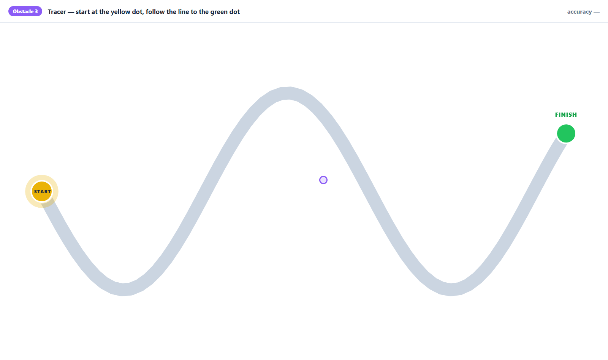
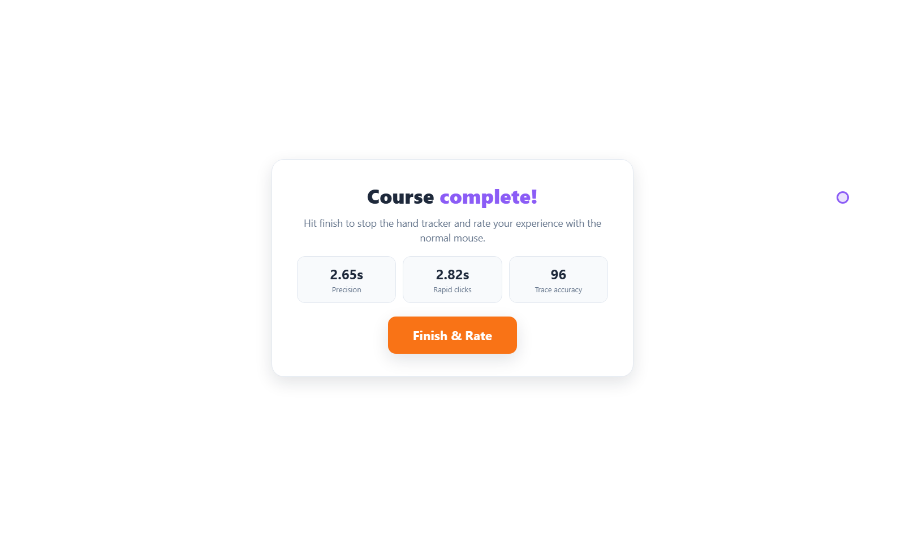
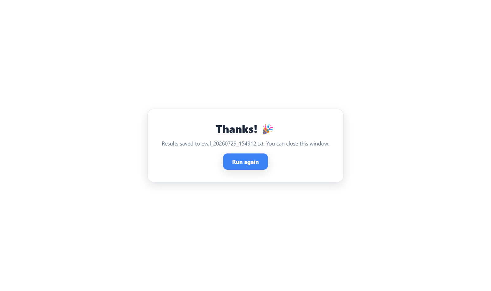
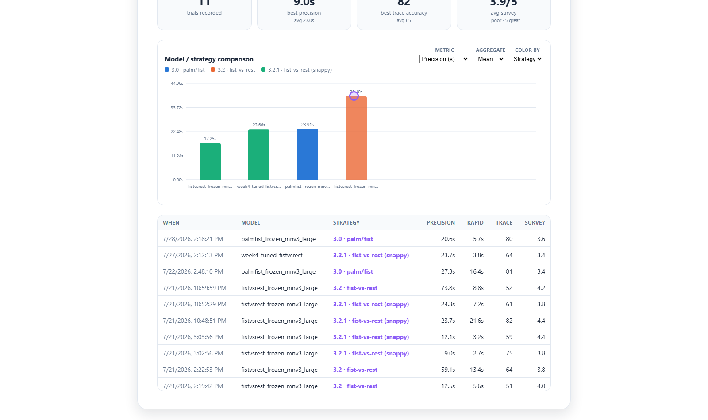
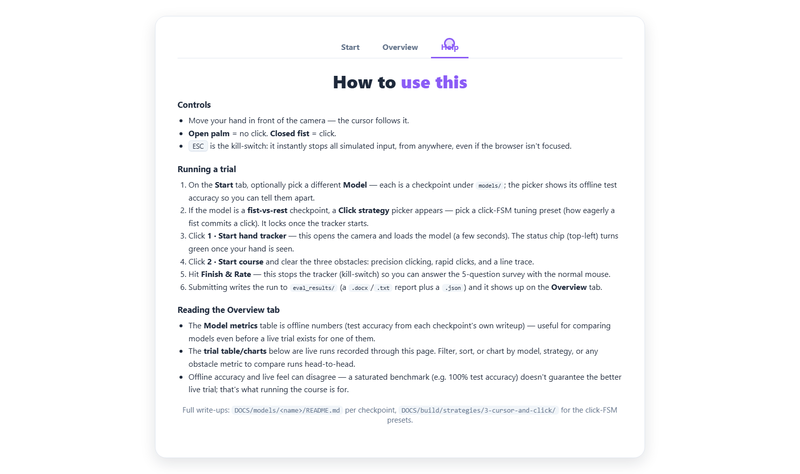

# Business-facing UI — walkthrough

**Deliverable:** M5A1 §1 (business-facing UI + walkthrough)
**The app:** the **Hand-Tracking Evaluation Course** — `src/eval_dashboard/`, a local
Flask + vanilla-JS single-page app.
**Non-technical user guide:** [how-to-use.md](how-to-use.md)
**Screenshots:** [ui-screenshots/](ui-screenshots/) (12 PNGs, regenerate with
`scripts/capture_ui_screenshots.js` — see [§6](#6-how-the-screenshots-were-made))

---

## 1. What this front-end is for

The model in this project does not produce a number a business user reads. It
produces a **control experience**: a webcam-driven cursor and a fist-squeeze
click. So the front-end is not a prediction form — it is a **usability
harness**. It hands a stranger the controller, makes them do three things every
FNAF player has to do (aim and click, click fast, hold a line), times them, and
asks them to rate it.

That framing is the whole design: a business user who has never heard of
MobileNetV3 can answer *"is this thing usable?"* in 90 seconds, and the answer
lands in a table next to the offline accuracy number, where the two can
disagree in public.

| | |
|---|---|
| **Who uses it** | Anyone I can put in front of the camera. No ML knowledge assumed. |
| **What they do** | Pick a model (optional), start the camera, clear three obstacles with their hand, rate it 1–5. |
| **What comes out** | Three timed/scored obstacle metrics + a 5-question survey, saved as a report file and charted against every previous trial. |

---

## 2. Walkthrough — screen by screen

### Start tab — inputs and controls


Everything a tester can change lives on one screen, above a two-step start:

- **Model** (dropdown) — which checkpoint under `models/` this run loads. Each
  option is labelled with its **offline test accuracy** (`palmfist_frozen_mnv3_large
  — 98.2% test acc`) and the sub-line adds class count and crop mode, so the
  picker itself explains what distinguishes the options. Populated from
  `GET /api/models`.
- **Click strategy** (appears only for a fist-vs-rest checkpoint) — the click-FSM
  preset: **3.2** steady (confidence ≥ 0.70, 3-frame confirm) or **3.2.1** snappy
  (≥ 0.80, 2-frame confirm). Hidden for models the presets don't fit, rather than
  shown-and-disabled, so a tester never picks something meaningless.
- **1 · Start hand tracker** — opens the camera and loads the model. Deliberately
  a separate button clicked with the **normal mouse**: you cannot bootstrap a hand
  controller with the hand controller.
- **2 · Start course** — stays disabled until `/api/status` reports the tracker
  actually running, so nobody starts a timed run into a dead camera.

Both pickers **lock** once the tracker starts — the checkpoint is loaded into the
loop by then, and a control that silently stops mattering is worse than a
disabled one.

### The three obstacles — the actual measurement
| | |
|---|---|
|  | **1 · Precision.** Five numbered buttons appear one at a time, each ≥ 220 px from the last, so every target is a real re-aim. Measures *can you put the cursor on a thing and click it.* Recorded: total time click-1→click-5 plus per-target splits. |
|  | **2 · Rapid clicks.** Press one big button 7 times; the bar fills as you go. This is the obstacle that exercises the click FSM's re-arm path — you cannot pass it without opening your hand between squeezes. Recorded: time from first to seventh click. |
|  | **3 · Tracer (preview).** The path, the yellow START dot and the green FINISH dot are all visible *before* the run begins, so the tester knows the shape of the task before being timed. |
|  | **3 · Tracer (in progress).** A pink breadcrumb shows where the hand actually went versus where the line is — this is the smoothing/jitter behaviour made visible. Recorded: time, mean pixel deviation, an accuracy score, and path coverage. |

The tracer header is the clearest example of a deliberate non-technical choice:
it reads **`accuracy 96 · 60% traced (need 70%)`**. Early testers hovered the
FINISH dot and nothing happened, because the coverage gate wasn't met and the
UI said nothing about it. Now the gate is on screen, live, in words.

### Finish → survey → saved
| | |
|---|---|
|  | **Finish gate.** The three headline scores, immediately, before any rating — the tester sees their own result rather than being asked to remember how it felt. |
|  | **Survey.** Five plain-language questions ("How well were you able to click?"), 1–5, no jargon. Hitting *Finish & Rate* calls `/api/finish`, which **stops the tracker** — the survey is answered with the normal mouse, so a controller that is hard to use can't skew its own rating. |
|  | **Saved.** The run is written to `eval_results/` and named, so a tester knows something persisted and I know which file to open. |

### Overview tab — the results surface


Two blocks, deliberately stacked in this order:

1. **Model metrics** — offline test accuracy per checkpoint, with the current pick
   tagged `SELECTED` and the top row tagged `BEST`. Parsed at launch straight out
   of [`DOCS/models/README.md`](../../models/README.md) rather than hand-copied
   into the app, so the dashboard cannot drift from the committed write-ups.
2. **Live trials** — aggregate tiles (trials recorded, best precision, best trace
   accuracy, average survey) over whatever slice the filters select.




The chart groups trials by **model/strategy pair** with a switchable metric,
aggregate, and colour-by; the table below shows the same filtered slice row by
row with its timestamp. Colours are assigned from the *full* run set, not the
filtered slice, so a series keeps its colour as you narrow the view. The
categorical palette was validated for colour-vision deficiency and contrast
before use; the table underneath is the accessible fallback for the low-contrast
slots.

The screenshots above show the **11 real trials** recorded between 2026-07-21 and
2026-07-28 across three model/strategy pairings — this is genuine head-to-head
data, not seeded demo rows.

### Help tab


The user guide lives **inside the app**, not only in this repo: controls, how to
run a trial, how to read the Overview, and — importantly — the sentence *"Offline
accuracy and live feel can disagree — a saturated benchmark (e.g. 100% test
accuracy) doesn't guarantee the better live trial; that's what running the course
is for."* A tester who reads only the Help tab still gets the honest framing.

---

## 3. How the UI connects to the model

This is the part I want to state precisely, because the straightforward answer
would be wrong.

**The dashboard does not call the HTTP endpoint.** It loads the checkpoint
**in-process** in a background tracker thread
([`src/eval_dashboard/tracker.py`](../../../src/eval_dashboard/tracker.py)), the
same per-frame pipeline as [`src/control/play.py`](../../../src/control/play.py):

```
browser ──POST /api/start──►  Flask (src/eval_dashboard/server.py)
                                └─► HandTracker thread
                                      webcam → MediaPipe (hull crop, pad 0.35, AD-25)
                                             → ONNX Runtime / PyTorch classifier
                                             → click FSM → pydirectinput
                                                              │
browser ◄──GET /api/status (700 ms poll)◄──────────────────────┘
        ◄── real OS cursor moves + real clicks ────────────────┘
```

The browser is **not** in the inference path at all. The tracker moves the real
OS cursor and fires real OS clicks, and the page receives them as ordinary mouse
events — which is exactly why the obstacle timings measure the controller and not
a simulation of it. The only model traffic over HTTP is *control and status*:
`/api/start`, `/api/status`, `/api/finish`, `/api/models`, `/api/strategies`,
`/api/history`, `/api/results`.

**Why not the endpoint.** The Week-4 deployment (AD-24) is a real, versioned
surface: [`src/serve/app.py`](../../../src/serve/app.py) serves whichever MLflow
registry version holds the `champion` alias, over a pyfunc artifact that carries
its own preprocessing, with `/health`, `/model`, and `/predict`. But the live loop
has a ~33 ms frame budget and the model alone costs ~35–40 ms in PyTorch on this
CPU, so an HTTP round-trip per frame is not affordable. The endpoint exists for
**validation, batch scoring, and giving the model a network-callable versioned
surface** — see the Week-4 [endpoint transcript](../week4/endpoint-transcript.md)
for real recorded requests and latencies. Claiming the dashboard consumes it
would be tidier and false.

So there are two model surfaces, on purpose:

| Surface | Path to the model | Used by |
|---|---|---|
| **Real-time** (this UI, and `play.py`) | in-process, ONNX Runtime, ~28 FPS measured | the obstacle course, the game |
| **HTTP** (`src/serve/app.py`) | MLflow registry → `champion` → pyfunc | validation, batch scoring, versioned access |

Both are fed by the same registry/checkpoint lineage, and the pyfunc reuses
training's own preprocessing so the two cannot silently disagree about what a
crop is.

---

## 4. How freshness / last-updated is surfaced

| Signal | Where it shows | Refresh |
|---|---|---|
| **Is the controller alive right now** | status chip, top-left: predicted label + confidence, FPS, click count, hand-seen dot (green/amber/red) | `GET /api/status` every **700 ms** |
| **Tracker errors** | same chip, red, with the error text (e.g. a camera that won't open) | same poll |
| **When each trial happened** | Overview table `WHEN` column — full local date-time per run, sortable, and the default sort | on tab open (`GET /api/history`) |
| **How many trials exist** | `11 trials recorded` tile, and `N of M trials shown` once a filter narrows it | on tab open + on every filter change |
| **Which offline numbers are current** | Model-metrics table, parsed from `DOCS/models/README.md` **at server launch** | restart picks up doc edits |
| **That a run persisted** | Done screen names the written file (`eval_20260729_154912.txt`) | on submit |

Run files are timestamped (`eval_<YYYYMMDD>_<HHMMSS>`), which makes the
filesystem itself the freshness record — `eval_results/` sorted by name is
sorted by time.

**Honest gaps.** The model-metrics table has no visible "as of" stamp — it is
fresh as of server launch, and a doc edit mid-session won't appear until
restart. And the offline accuracies are *transcribed from the committed
write-ups*, not recomputed on load; that's deliberate (the checkpoints are
git-ignored, the doc is what survives) but it means the table is only as fresh as
`DOCS/models/README.md`.

---

## 5. Design decisions made for a non-technical user

1. **The task is a game, not a form.** Nobody is asked to interpret a
   probability. "Click these five buttons" needs no explanation, and it happens to
   measure precisely what the controller has to do in FNAF.
2. **Two-step start, mouse first.** Camera on, *then* course. A single "Start"
   would have meant a tester's first hand-controlled action was the one that began
   their timed run.
3. **The kill-switch is real and advertised.** `ESC` disables all simulated input
   instantly, from anywhere, even when the browser isn't focused — stated on both
   the Start and Help tabs. Anything that moves someone's cursor for them needs a
   brake they already know about.
4. **The survey runs with the normal mouse.** `/api/finish` stops the tracker
   before the rating screen. A frustrated tester should not have to fight the
   controller to tell me the controller is frustrating.
5. **Gates are never silent.** The tracer says how much is traced and how much is
   needed; the course button says why it's disabled; the tracker chip says what the
   model currently thinks. Every dead-end got a sentence.
6. **Controls that stopped mattering get disabled, and controls that never
   mattered get hidden.** Locked pickers after start; no strategy picker for a
   model the presets don't fit.
7. **Plain-language questions, spread scale.** "How well did it do what you
   wanted?" over "rate the F1 score."
8. **Offline vs. live disagreement is stated in the product,** not just in the
   report — the Help tab says a saturated benchmark doesn't win the live trial.
9. **Custom pointer.** The OS arrow is hidden and replaced with a ring that
   flashes on click, because with a hand controller you need to see *the click*, not
   just the position.

---

## 6. How the screenshots were made

`scripts/capture_ui_screenshots.js` drives the **real** dashboard through
Playwright (headless Chromium) and writes all 12 PNGs, so this deliverable can be
regenerated rather than re-shot by hand:

```powershell
$scratch = "$env:TEMP\eval_shots"; mkdir $scratch -Force
Copy-Item eval_results\* $scratch          # real trial history, scratch write target
python -m src.eval_dashboard.server --no-tracker --no-browser --port 5057 --results-dir $scratch
# in another terminal:
$env:NODE_PATH = (npm root -g)             # needs a global `playwright`
node scripts/capture_ui_screenshots.js --port 5057
```

**What is real and what isn't, exactly:** the app, the layout, the 11 trials in
the Overview tab, and the obstacle logic/timing/scoring are all real. The
**pointer** in screens 06–12 is Playwright's synthetic mouse, because the server
ran with `--no-tracker` — nobody's hand drove those frames, and the run they
produced is labelled `mouse (no tracker) · — UI test` by the server itself and
was written to a scratch directory, not into `eval_results/`. The hand-driven
numbers in this deliverable are the **11 committed trials**, not the capture run.

**One bug fixed while capturing.** The status chip showed a permanent
`connecting…` in `--no-tracker` mode. Cause: `.status-chip { display: flex }`
outranks the user-agent's `[hidden] { display: none }`, so every `hidden`
attribute the JS set on a styled element did nothing — the same latent bug
affected `#ovCharts` and the chart legend. Fixed globally with
`[hidden] { display: none !important; }` in `static/style.css`.
