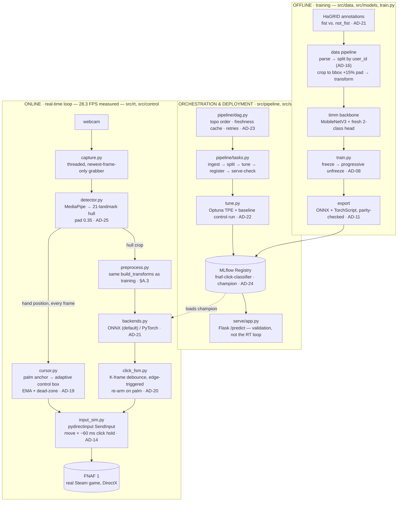

# Fnaf_CV — Hands-Free *Five Nights at Freddy's*

**Play a real commercial video game with your bare hand in front of a webcam.**
MediaPipe hand tracking moves the mouse cursor; a transfer-learned MobileNetV3
classifies the hand crop as **fist (click)** or **not-fist (no click)**; a debounced
state machine turns each palm→fist squeeze into exactly one mouse click, delivered
to the real Steam game via simulated DirectX input.

**Status (2026-07-29, end of Week 5): MVP met.** Night 1 of FNAF has been
completed **hands-free** — cursor and clicks both hand-driven, no keyboard or
mouse. It was not a clean run (missed clicks and re-squeezes), it wasn't
instrumented, and there's no recording, so it is reported as a **qualitative**
result. The measured numbers in this repo are the offline metrics and the 11
timed usability trials, not the game session. See
[retrospective.md](DOCS/class-related/week5/retrospective.md) and the
[Week-5 status note](DOCS/build/plan.md#week-5-final-status-2026-07-29--mvp-met-honestly-scoped).

```
your hand  ─►  webcam  ─►  MediaPipe  ─┬─►  cursor mapper  ─►  move the real mouse
                                       └─►  hand crop  ─►  CNN  ─►  click FSM  ─►  click
```

| | |
|---|---|
| **Dataset** | [HaGRID](https://github.com/hukenovs/hagrid) — 18 static gesture classes; this project trains on `fist` vs. a 6-gesture `not_fist` negative (AD-21) |
| **Model** | `timm` `mobilenetv3_large_100`, pretrained, fresh 2-class head, frozen → 2 blocks unfrozen |
| **Deployed model** | `fnaf-click-classifier` v1, MLflow registry, `champion` alias — **1.0000** test accuracy (saturated benchmark, see caveat below) |
| **Live loop** | **28.3 FPS** measured end-to-end on CPU via ONNX Runtime (~9–11 FPS on battery — power state matters more than any code fix) |
| **Platform** | Windows 11, Python 3.13, CPU-only inference |

---

## 1. The problem

Every mainstream game assumes a player who can comfortably use a keyboard and
mouse. That assumption excludes people with motor limitations, and it leaves an
interesting question unasked: **can a webcam and a laptop CPU replace the mouse
well enough to play a game that punishes you for being slow?**

FNAF is a deliberately hostile target for this. It is entirely mouse-driven
(doors, lights, camera monitor), and it is *unforgiving* — half a second of input
lag or one misread gesture gets you killed. That makes the business metric
brutally honest and impossible to fake with a test-set number: **can you survive
the night?** A gesture controller that scores 100% offline and can't close a door
in time has failed.

**The deliverable is a control layer, not a prediction.** Which is why the
business-facing front-end is not a dashboard of metrics but a **usability
obstacle course** (§5) that hands the controller to a stranger and scores what
they can actually do with it.

### The honest headline

| Claim | Evidence | Caveat |
|---|---|---|
| Night 1 completed hands-free | played through on `fistvsrest_frozen_mnv3_large` | qualitative; rough edges; not recorded or instrumented |
| Deployed model scores 1.0000 on test | 327/327, leakage-audited, verified on an independent eval path | **the offline benchmark is saturated** — it can no longer separate candidate models, and this model has never been validated live |
| Controller is usable by a human | 11 timed obstacle-course trials, 2026-07-21 → 07-28 | all trials are the author's own hands (n=1 subject) |
| Live crop geometry is now calibrated | measured over 27k–29k images/gesture (AD-25) | measured on HaGRID stills, so it isolates *geometry*; a **lower bound** on the live gap |

---

## 2. System architecture

Three subsystems: an **offline** training pipeline, a Week-4 **orchestration &
deployment** layer, and the **online** real-time loop that plays the game.



*Designed standalone version with a legend and the decision table:*
[DOCS/build/diagrams/](DOCS/build/diagrams/README.md) · *zoomed-in flows for the
click FSM, cursor mapper, and one frame's trip through the loop:*
[flows.md](DOCS/build/diagrams/flows.md)

### Components

| Subsystem | Module | Responsibility |
|---|---|---|
| **Data** | [`src/data/`](src/data/) | HaGRID JSON → index → 70/15/15 split **grouped by `user_id`** (no subject leakage, AD-16) → bbox crop → transforms. `padded_bbox_pixels()` is the single source of truth for crop geometry, shared with the live detector. |
| **Model** | [`src/models/build.py`](src/models/build.py) | `timm` backbone + fresh N-class head, `freeze_all_but_head` / `unfreeze_last_n_blocks`. |
| **Training** | [`src/train.py`](src/train.py) | Config-driven; fast linear-probe path (cached frozen features) and end-to-end path. Self-describing checkpoints. |
| **Tuning** | [`src/tune.py`](src/tune.py) | Optuna **TPE** over cached features (Arm A) + structural `unfreeze × augmentation` grid (Arm B). Always re-runs the deployed recipe as a **control** and warns if it can't reproduce the committed baseline — the check that found AD-22. |
| **Orchestration** | [`src/pipeline/`](src/pipeline/) | Local task DAG: topological order, per-task freshness → `cached`, retries, upstream-failure propagation, JSON run records. **Event-triggered** (`--if-data-changed`), not scheduled (AD-23). |
| **Deployment** | [`src/serve/`](src/serve/) | MLflow **pyfunc** artifact carrying its own preprocessing (so a served model can't drift from the training contract) + Flask `/health` `/model` `/predict` over the `champion` alias (AD-24). |
| **Real-time** | [`src/rt/`](src/rt/) | Threaded capture (kills ~67 ms of camera backlog), MediaPipe detector, cursor mapper, ONNX/PyTorch backend chosen at load and **parity-checked**. |
| **Control** | [`src/control/`](src/control/) | Click FSM (edge-triggered, one click per squeeze, cooldown), `pydirectinput` input simulation with a ~60 ms button hold, **ESC global kill-switch**. |
| **Evaluation** | [`src/eval_final.py`](src/eval_final.py), [`src/eval_openset.py`](src/eval_openset.py), [`src/eval_dashboard/`](src/eval_dashboard/) | Report-once test metrics + click-gate sweep; open-set false-click rate on unseen gestures; the usability obstacle course. |

**The critical contract** (`DOCS/build/architecture-and-decisions.md` §A.3):
runtime preprocessing must be byte-for-byte equivalent to training — same size,
interpolation, normalization, crop policy — which is why `build_transforms()` and
`padded_bbox_pixels()` are shared code rather than reimplemented. The *crop-source*
half of that contract was measured, found violated, and recalibrated in AD-25;
that story is the most instructive thing in this repo.

---

## 3. Tech stack

Verified versions from the working environment (2026-07-29):

| Layer | Technology | Version |
|---|---|---|
| Language | Python (Windows 11 Pro, PowerShell) | 3.13.1 |
| Deep learning | `torch` / `torchvision` | 2.10.0 / 0.25.0+cpu |
| Pretrained backbones | `timm` | 1.0.27 |
| Hand detection | `mediapipe` (Hand Landmarker) | 0.10.35 |
| Camera / imaging | `opencv-python`, `pillow`, `numpy` | 5.0.0.93 / 11.3.0 / 2.2.3 |
| Runtime inference | `onnx`, `onnxruntime`, `onnxscript` | 1.22.0 / 1.28.0 / 0.7.1 |
| Input simulation | `PyDirectInput` | 1.0.4 |
| Experiment tracking + registry | `mlflow` | 3.10.1 |
| Hyper-parameter search | `optuna` (TPE) | 4.8.0 |
| Web (endpoint + dashboard) | `flask` | 3.1.0 |
| Data / metrics | `pandas`, `scikit-learn` | 2.2.3 / 1.6.1 |
| Plots / logging | `matplotlib`, `tensorboard` | 3.10.5 / 2.21.0 |
| Data acquisition | `remotezip` (HTTP range requests) | 0.12.3 |
| Reports (optional) | `python-docx` | not installed → `.txt` fallback |
| Screenshot capture (dev) | Node + `playwright` (global npm) | 22.14.0 / 1.60.0 |

Training was done on an RTX 4060 Laptop GPU (8 GB); **all inference in this repo
runs CPU-only** (`torch` here is a `+cpu` build), which is why ONNX Runtime — 3–4×
faster than PyTorch on this CPU — is the default live backend.

---

## 4. Setup (for a developer)

```powershell
git clone <this repo>
cd Fnaf_CV
python -m venv .venv
.\.venv\Scripts\Activate.ps1
pip install -r requirements.txt
```

For a CUDA training box, install `torch`/`torchvision` from
[pytorch.org](https://pytorch.org) **before** the requirements file so you get the
CUDA wheel rather than the CPU one.

### Get the data

`DATA/` in this repo holds **annotations only** — JSON with a normalized COCO bbox
plus 21 landmarks per image UUID. The images are a separate download (the full
HaGRID set is 716 GB; don't). Both downloaders use HTTP range requests to pull
only the UUIDs they need:

```powershell
# held-out TEST set (~100 images/class, matches DATA/ann_subsample)
python src/data/download_subsample.py --classes fist palm

# train/val pool, EXCLUDING every subsample UUID (+ MD5 verify) so test can't leak
python src/data/download_train_val.py --classes fist palm --per-class 500

# sanity-check the recomputed, user-grouped split
python -m src.data.dataset
```

`DATA/`, `models/`, `mlruns/`, and `pipeline_runs/` are all git-ignored — weights
and images never enter version control, which is why every checkpoint has a
committed write-up under [`DOCS/models/`](DOCS/models/README.md).

---

## 5. Running it

### The training pipeline (orchestrated)

```powershell
python -m src.pipeline.run --list                      # what the DAGs do, in plain language
python -m src.pipeline.run --dag training --dry-run    # order + what would actually run
python -m src.pipeline.run --dag training              # fresh tasks are skipped
python -m src.pipeline.run --dag training --if-data-changed   # the event trigger
python -m src.pipeline.run --dag training --force      # ignore freshness, redo everything
```

Individual stages, if you'd rather drive them yourself:

```powershell
python -m src.train --config configs/fistvsrest_frozen.yaml   # train
python -m src.tune  --stage all --config configs/tune_fistvsrest.yaml   # search + register
python -m src.eval_final --checkpoint models/week4_tuned_fistvsrest/best.pt   # report once
python -m src.eval_openset       # false clicks on unseen gestures (AD-21)
mlflow ui --backend-store-uri ./mlruns                        # browse the runs
```

### The model as a service

```powershell
python -m src.serve.app                        # serves the `champion` registry alias
python -m src.serve.app --checkpoint models/week4_tuned_fistvsrest/best.pt   # no registry
curl http://127.0.0.1:8765/health
```

`POST /predict` takes `{"image_b64": ...}`, `{"images": [...]}`, or a multipart
`file`, and returns `predicted_class`, `confidence`, `p_click`, and the `click`
decision at the AD-20 gate. The image must be an **already-cropped hand** — same
contract as the pyfunc artifact. Real recorded traffic:
[endpoint-transcript.md](DOCS/class-related/week4/endpoint-transcript.md).

> This endpoint is **not** in the real-time path. The live loop has a ~33 ms frame
> budget and calls the model in-process; an HTTP round-trip per frame isn't
> affordable (AD-24).

### The real-time loop

```powershell
# 1. look at it first — no OS input, HUD only
python -m src.rt.webcam_demo --checkpoint models/week4_tuned_fistvsrest/best.pt

# 2. full control loop, still sending nothing to the OS
python -m src.control.play --checkpoint models/week4_tuned_fistvsrest/best.pt --dry-run

# 3. live: real cursor, real clicks. ESC = kill-switch.
python -m src.control.play --checkpoint models/week4_tuned_fistvsrest/best.pt
```

**Run `--dry-run` first, every time.** Step 3 takes over the mouse. `ESC` disables
all simulated input instantly, from anywhere, focused or not — and releases the
button first, so a mid-press kill can't leave it stuck down.

Useful knobs: `--pad 0.15` reverts the AD-25 crop recalibration for an A/B,
`--strategy 3.2|3.2.1` picks the click-FSM preset, `--backend torch` and
`--no-threaded-capture` revert the 3.2.3 latency work, `--click-hold 0` restores
the old zero-length click pulse.

### The UI (business-facing)

```powershell
# UI only — drive it with your normal mouse, no camera
python -m src.eval_dashboard.server --no-tracker

# full pipeline, no real OS input (setup/testing)
python -m src.eval_dashboard.server --checkpoint models/week4_tuned_fistvsrest/best.pt --dry-run

# live: hand-driven cursor and clicks into the browser
python -m src.eval_dashboard.server --checkpoint models/week4_tuned_fistvsrest/best.pt
```

Opens `http://127.0.0.1:5000/`. Press **F11** for fullscreen so the cursor can
reach every corner. Runs are written to `eval_results/`.

- **Non-technical guide:** [how-to-use.md](DOCS/class-related/week5/how-to-use.md)
- **Technical walkthrough + screenshots:** [ui-walkthrough.md](DOCS/class-related/week5/ui-walkthrough.md)


---

## 6. Documentation

### Required course documents

| Deliverable name | This repo | Purpose |
|---|---|---|
| `claude.md` | [DOCS/AI/Claude.md](DOCS/AI/Claude.md) | AI-usage **plan** — how AI was actually used, and the hard line on what wasn't delegated |
| `ai-usage-log.md` | [DOCS/AI/AI-usage.md](DOCS/AI/AI-usage.md) | Weekly AI-usage **log** + final retrospective |
| `implementation-plan.md` | [DOCS/build/plan.md](DOCS/build/plan.md) | Living roadmap + weekly status, ending with the Week-5 final note |

*(Names differ from the assignment's because these files predate it and are
cross-linked from dozens of places; the mapping is also in
[week5/README.md](DOCS/class-related/week5/README.md). `CLAUDE.md` at the root is
a different file — the agent-context file — and can't share a name with
`Claude.md` on a case-insensitive filesystem.)*

### Start here for any "why"

| Doc | What's in it |
|---|---|
| [architecture-and-decisions.md](DOCS/build/architecture-and-decisions.md) | Architecture + **25 decision records** (`AD-NN`). The single source of truth for technical direction. |
| [code-map.md](DOCS/build/code-map.md) | Every file under `src/`, grouped by subsystem, with its role. |
| [strategies/](DOCS/build/strategies/README.md) | The measured evolution: full-frame → two-stage crop → cursor+click → fist-vs-rest → snappier FSM → tuned champion → latency → crop geometry. Each one is a real experiment with numbers. |
| [DOCS/models/](DOCS/models/README.md) | Per-checkpoint write-ups and honest test numbers (the weights are git-ignored; these docs are what survive). |
| [diagrams/](DOCS/build/diagrams/README.md) | System diagram + zoomed-in flow diagrams. |

### Weekly deliverables

| Week | Focus | Report |
|---|---|---|
| 1 | Proposal | [proposal.md](DOCS/legacy/proposal.md) *(pre-pivot; see AD-17)* |
| 2 | Data understanding | [data-understanding-report.md](DOCS/class-related/week2/data-understanding-report.md) · [EDA notebook](DOCS/class-related/week2/eda-notebook.ipynb) |
| 3 | Experiment tracking & evaluation | [ml-experimentation-report.md](DOCS/class-related/week3/ml-experimentation-report.md) |
| 4 | Tuning, orchestration, deployment | [tuning-orchestration-report.md](DOCS/class-related/week4/tuning-orchestration-report.md) |
| 5 | UI, docs, retrospective | [week5/](DOCS/class-related/week5/README.md) |

Day-by-day engineering log, including the failures:
[daily-update.md](DOCS/class-related/daily-update.md).

---

## 7. Things worth knowing before you trust a number here

- **The offline benchmark is saturated.** The deployed model scores 327/327. That
  survived a leakage audit and an independent eval path, but it means test accuracy
  can no longer rank candidates. The metric with headroom left is the **open-set
  false-click rate** on unseen gestures.
- **Every published false-click number was measured on annotated crops**, not live
  MediaPipe crops, and is therefore optimistic by an unmeasured amount (AD-25).
- **A ~5-point "tuning win" was an initialization artifact.** timm's default head
  init on a 2-class head is worth ~5 val points on its own, so the four earlier
  checkpoints are **not** directly comparable to the Week-4 one (AD-22). The
  tuning report presents this as a three-rung ladder, not a win.
- **Power state beats every code optimization.** On battery this laptop pins to its
  1.4 GHz base clock and the live loop drops 28.3 FPS → 9–11 FPS. `play.py` warns
  at startup; the benchmark stamps AC/battery and CPU clock on every report.
- **All 11 usability trials are the author's own hands.** The controller has never
  been evaluated by anyone else.

---

## 8. Scope boundaries

Solo project · **static hand poses only** (cursor motion is per-frame geometry, not
a temporal model) · **FNAF 1 only** · drives the **real Steam game**, not a clone ·
Windows-only by construction (`pydirectinput` / DirectX SendInput).

Pre-pivot history — the original 8-gesture vocabulary proposal and phase plans —
is preserved in [DOCS/legacy/](DOCS/legacy/README.md). The 2026-07-14 pivot to
cursor control is [AD-17](DOCS/build/architecture-and-decisions.md).

**Reference tutorial** that seeded the transfer-learning approach:
[timm/HF image-classifier transfer learning](https://christianjmills.com/posts/pytorch-train-image-classifier-timm-hf-tutorial/)
